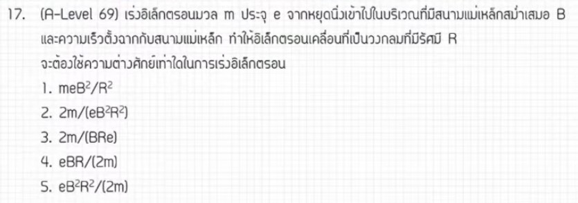

จากการวิเคราะห์ข้อสอบ A-Level ฟิสิกส์ มีนาคม 2569 **ข้อที่ 17** จากแหล่งอ้างอิงของพี่ตั้ว Physics Blueprint พบว่าเป็นเรื่อง **แม่เหล็กและไฟฟ้า (การเคลื่อนที่ของอนุภาคที่มีประจุในสารสนามแม่เหล็ก)** ซึ่งมีรายละเอียดวิธีทำและเนื้อหาดังนี้ครับ

### **1. เฉลยวิธีทำโจทย์ข้อ 17 อย่างละเอียด**
โจทย์ข้อนี้เป็นสถานการณ์ที่อิเล็กตรอนถูกเร่งผ่านความต่างศักย์ไฟฟ้า ($V$) จนมีความเร็วค่าหนึ่ง จากนั้นจึงวิ่งเข้าไปในบริเวณที่มีสนามแม่เหล็กสม่ำเสมอ ($B$) ในทิศตั้งฉาก ทำให้เคลื่อนที่เป็นวงกลมรัศมี $R$

**ข้อมูลที่โจทย์กำหนด (ในรูปตัวแปร):**
*   **ประจุของอิเล็กตรอน:** $e$
*   **มวลของอิเล็กตรอน:** $m$
*   **รัศมีการเคลื่อนที่:** $R$
*   **สนามแม่เหล็ก:** $B$
*   **สิ่งที่โจทย์ถาม:** ความต่างศักย์ไฟฟ้า $V$ ในรูปของตัวแปรอื่น ๆ

**ขั้นตอนการคำนวณ:**
1.  **พิจารณาช่วงการเร่งประจุ:** พลังงานศักย์ไฟฟ้าที่เปลี่ยนไปจะเท่ากับพลังงานจลน์ที่เพิ่มขึ้น
    *   $eV = \frac{1}{2}mv^2$ — (สมการที่ 1)
2.  **พิจารณาการเคลื่อนที่เป็นวงกลมในทิศตั้งฉากกับสนามแม่เหล็ก:** แรงแม่เหล็กทำหน้าที่เป็นแรงเข้าสู่ศูนย์กลาง
    *   $evB = \frac{mv^2}{R}$
    *   จัดรูปหาค่ารัศมี: $R = \frac{mv}{eB}$ หรือจัดรูปความเร็วได้ $v = \frac{eBR}{m}$
3.  **นำค่า $v$ ไปแทนในสมการพลังงาน (สมการที่ 1):**
    *   $eV = \frac{1}{2}m \left( \frac{eBR}{m} \right)^2$
    *   $eV = \frac{1}{2}m \left( \frac{e^2 B^2 R^2}{m^2} \right)$
    *   $eV = \frac{e^2 B^2 R^2}{2m}$
4.  **แก้สมการหา $V$:**
    *   $V = \frac{e B^2 R^2}{2m}$

**สรุปคำตอบ:** ความต่างศักย์ไฟฟ้ามีค่าเท่ากับ **$\frac{e B^2 R^2}{2m}$** (ตอบตัวเลือกที่ 5)

---

### **2. เนื้อหาเพื่อศึกษาเพิ่มเติม**
*   **พลังงานในงานไฟฟ้า:** เมื่อประจุเคลื่อนที่ผ่านความต่างศักย์ งานที่ทำจะเปลี่ยนเป็นพลังงานจลน์ตามความสัมพันธ์ $W = qV$
*   **แรงแม่เหล็ก ($F_B$):** แรงที่กระทำต่อประจุที่วิ่งตัดสนามแม่เหล็กมีค่า $F = qvB \sin\theta$ หากวิ่งตั้งฉาก ($\theta = 90^\circ$) แรงจะมีค่าสูงสุดและทำให้วัตถุเคลื่อนที่เป็นวงกลม
*   **รัศมีความโค้ง ($R$):** รัศมีของการเคลื่อนที่แบบวงกลมหาได้จาก $R = \frac{mv}{qB}$ ซึ่งแสดงให้เห็นว่ารัศมีจะแปรผันตรงกับโมเมนตัมและแปรผกผันกับความเข้มสนามแม่เหล็ก

---

### **3. กลยุทธ์แก้โจทย์ประเภทนี้**
*   **เชื่อมโยง 2 เหตุการณ์ด้วย "ความเร็ว":** โจทย์ประเภทนี้มักแบ่งเป็น 2 ช่วง คือช่วงเร่ง (ไฟฟ้า) และช่วงโค้ง (แม่เหล็ก) ตัวแปรที่จะเชื่อมทั้งสองส่วนเข้าด้วยกันคือ **ความเร็ว ($v$)**
*   **การจัดรูปตัวแปร (Algebraic Manipulation):** ในข้อสอบ A-Level แนวติดตัวแปร การยกกำลังสองเพื่อกำจัดเครื่องหมายราก (Square root) จะช่วยให้การแทนค่าและตัดตัวแปรทำได้ง่ายขึ้น เช่น การใช้ $R^2 = \frac{m^2v^2}{e^2B^2}$ แทนค่าลงไป
*   **ตรวจสอบหน่วยและตัวแปร:** ให้สังเกตตัวเลือกว่าต้องการตัวแปรใดบ้าง ตัวแปรที่เราสมมติขึ้นเอง (เช่น $v$) จะต้องถูกแทนค่าและหายไปในขั้นตอนสุดท้าย

---

### **4. ตัวอย่างโจทย์เพิ่มเติมเพื่อฝึกทำ**

**โจทย์:** อนุภาคที่มีประจุ $q$ มวล $m$ ถูกเร่งจากหยุดนิ่งผ่านความต่างศักย์ $V$ แล้วเข้าไปในท้องสนามแม่เหล็กสม่ำเสมอ $B$ จนเคลื่อนที่เป็นวงกลมรัศมี $R$ หากเปลี่ยนเป็นเร่งอนุภาคเดิมผ่านความต่างศักย์ $4V$ รัศมีการเคลื่อนที่จะเปลี่ยนเป็นกี่เท่าของเดิม?

**วิธีคิด:**
1.  **วิเคราะห์ความสัมพันธ์:** จากสูตร $V = \frac{q B^2 R^2}{2m}$ จะเห็นว่า $V \propto R^2$ หรือ $R \propto \sqrt{V}$
2.  **เปรียบเทียบ:** เมื่อเปลี่ยน $V$ เป็น $4V$
    *   $R_{ใหม่} \propto \sqrt{4V}$
    *   $R_{ใหม่} = 2 \sqrt{V} = 2R_{เดิม}$
3.  **คำตอบ:** รัศมีการเคลื่อนที่จะเพิ่มขึ้นเป็น **2 เท่า** ของเดิม

*(หมายเหตุ: การวิเคราะห์และขั้นตอนการจัดรูปตัวแปรอ้างอิงตามแนวทางการสอนของพี่ตั้ว Physics Blueprint จากแหล่งอ้างอิงที่ได้รับ)*