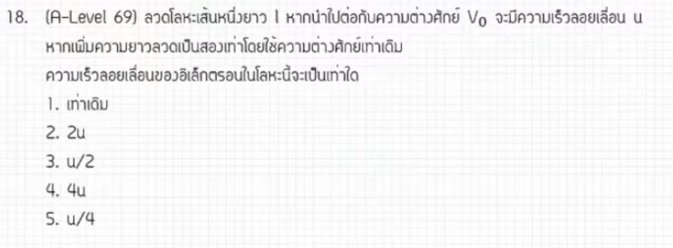

จากการวิเคราะห์ข้อสอบ A-Level ฟิสิกส์ มีนาคม 2569 **ข้อที่ 18** จากแหล่งอ้างอิงของพี่ตั้ว Physics Blueprint พบว่าเป็นเรื่อง **ไฟฟ้ากระแสตรง (ความต้านทานและความเร็วลอยเลื่อน)** ซึ่งมีประเด็นที่น่าสนใจคือการนำเรื่อง "ความเร็วลอยเลื่อน" ที่ไม่ได้ออกสอบมานานกลับมาเล่นอีกครั้งครับ มีรายละเอียดดังนี้

### **1. เฉลยวิธีทำโจทย์ข้อ 18 อย่างละเอียด**
โจทย์สถานการณ์นี้กล่าวถึงลวดตัวนำที่มีความยาวเพิ่มขึ้นเป็น 2 เท่า โดยที่ยังคงต่อกับแหล่งกำเนิดไฟฟ้าแรงดันเท่าเดิม และถามถึงการเปลี่ยนแปลงของความเร็วลอยเลื่อนของอิเล็กตรอน

**ข้อมูลที่โจทย์กำหนด (ในรูปตัวแปร):**
*   **ความเร็วลอยเลื่อนเริ่มต้น:** $u$
*   **ความยาวลวดเริ่มต้น:** $L$
*   **ความยาวลวดใหม่:** $2L$ (ไม่ใช่การรีดลวด แต่เป็นการเพิ่มความยาวโดยที่พื้นที่หน้าตัด $A$ ยังคงเดิม)
*   **แรงเคลื่อนไฟฟ้า ($E$):** เท่าเดิม

**ขั้นตอนการคำนวณ:**
1.  **วิเคราะห์ความต้านทาน ($R$):** จากสูตร $R = \rho \frac{L}{A}$ เมื่อชนิดลวด ($\rho$) และพื้นที่หน้าตัด ($A$) คงที่ ความต้านทานจะแปรผันตรงกับความยาว ($R \propto L$)
    *   ดังนั้น เมื่อความยาวเพิ่มเป็น $2L$ ความต้านทานใหม่จะกลายเป็น **$2R$**
2.  **วิเคราะห์กระแสไฟฟ้า ($I$):** จากกฎของโอห์ม $I = \frac{V}{R}$ เมื่อแรงดัน $V$ คงที่ กระแสจะแปรผกผันกับความต้านทาน ($I \propto \frac{1}{R}$)
    *   เมื่อความต้านทานเพิ่มเป็น $2R$ กระแสไฟฟ้าจะลดลงเหลือ **$I/2$**
3.  **วิเคราะห์ความเร็วลอยเลื่อน ($v_d$):** จากสูตร $I = neAv_d$ (หรือที่พี่ตั้วเรียกว่าสูตร "ไอเวน" - $I = venA$)
    *   จะเห็นว่ากระแสไฟฟ้าแปรผันตรงกับความเร็วลอยเลื่อน ($I \propto v_d$) เมื่อ $n, e, A$ คงที่
    *   ในเมื่อกระแสไฟฟ้าลดลงเหลือครึ่งหนึ่ง ความเร็วลอยเลื่อนใหม่จึงต้องลดลงเหลือครึ่งหนึ่งด้วย คือ **$u/2$**

**สรุปคำตอบ:** ความเร็วลอยเลื่อนใหม่มีค่าเท่ากับ **$u/2$**

---

### **2. เนื้อหาเพื่อศึกษาเพิ่มเติม**
*   **ความเร็วลอยเลื่อน (Drift Velocity):** คือความเร็วเฉลี่ยของอิเล็กตรอนอิสระที่เคลื่อนที่ในตัวนำเมื่อมีสนามไฟฟ้ามากระทำ ปกติจะมีความเร็วน้อยมาก (ประมาณหน่วยมิลลิเมตรต่อวินาที)
*   **สูตร $I = neAv_d$:**
    *   $I$ = กระแสไฟฟ้า (A)
    *   $n$ = ความหนาแน่นอิเล็กตรอนอิสระ (ตัวต่อลูกบาศก์เมตร)
    *   $e$ = ประจุอิเล็กตรอน ($1.6 \times 10^{-19}$ C)
    *   $A$ = พื้นที่หน้าตัดของลวด (m²)
    *   $v_d$ = ความเร็วลอยเลื่อน (m/s)
*   **สภาพต้านทานและความยาว:** ต้องระวังความแตกต่างระหว่าง **"การเพิ่มความยาวลวด"** (พื้นที่หน้าตัดคงเดิม) กับ **"การรีดลวด"** (ปริมาตรคงเดิม แต่พื้นที่หน้าตัดจะเล็กลง) ซึ่งโจทย์ข้อนี้ระบุชัดว่าไม่ใช่การรีดลวด

---

### **3. กลยุทธ์แก้โจทย์ประเภทนี้**
*   **มองหาความสัมพันธ์แบบแปรผัน:** วิธีที่รวดเร็วที่สุดคือการไล่ลำดับการแปรผัน $L \rightarrow R \rightarrow I \rightarrow v_d$ ซึ่งจะช่วยให้หาคำตอบได้ในใจโดยไม่ต้องตั้งสมการเต็ม
*   **ระวังคำสำคัญในโจทย์:** ต้องแยกให้ออกว่าโจทย์กำหนดให้พื้นที่หน้าตัดคงที่หรือปริมาตรคงที่ เพราะผลลัพธ์ของความต้านทานจะต่างกันมหาศาล
*   **จดจำสูตรที่เกี่ยวข้อง:** แม้เรื่องความเร็วลอยเลื่อนจะไม่ค่อยออกสอบบ่อยในระยะหลัง แต่การจำสูตรพื้นฐานอย่าง $I = neAv_d$ ยังมีความจำเป็นสำหรับข้อสอบแนววิเคราะห์ตัวแปร

---

### **4. ตัวอย่างโจทย์เพิ่มเติมเพื่อฝึกทำ**

**โจทย์:** ลวดทองแดงเส้นหนึ่งมีอิเล็กตรอนเคลื่อนที่ด้วยความเร็วลอยเลื่อน $v$ ถ้าเปลี่ยนไปใช้ลวดชนิดเดิมแต่มีรัศมีของพื้นที่หน้าตัดเพิ่มเป็น $2$ เท่า โดยต่อกับแรงดันไฟฟ้าเท่าเดิม ความเร็วลอยเลื่อนใหม่จะเป็นกี่เท่าของเดิม?

**วิธีคิด:**
1.  **รัศมีเพิ่ม 2 เท่า:** พื้นที่หน้าตัด $A = \pi r^2$ จะเพิ่มขึ้นเป็น **$4$ เท่า**
2.  **ความต้านทาน ($R$):** จาก $R = \rho \frac{L}{A}$ เมื่อ $A$ เพิ่ม 4 เท่า $R$ จะลดลงเหลือ **$1/4$** ของเดิม
3.  **กระแสไฟฟ้า ($I$):** จาก $I = V/R$ เมื่อ $R$ ลดเหลือ $1/4$ กระแส $I$ จะเพิ่มขึ้นเป็น **$4$ เท่า**
4.  **ความเร็วลอยเลื่อน ($v_d$):** จาก $I = neAv_d$ จะได้ $v_d = \frac{I}{neA}$
    *   เนื่องจาก $I$ เพิ่ม 4 เท่า และ $A$ ก็เพิ่ม 4 เท่าด้วยเช่นกัน
    *   $v_{ใหม่} = \frac{4I}{ne(4A)} = \frac{I}{neA} = v$
**คำตอบ:** ความเร็วลอยเลื่อน **เท่าเดิม**

*(หมายเหตุ: การวิเคราะห์และขั้นตอนการทำอ้างอิงตามแนวทาง "การใช้เหตุและผล" จากแหล่งอ้างอิงของพี่ตั้ว Physics Blueprint)*