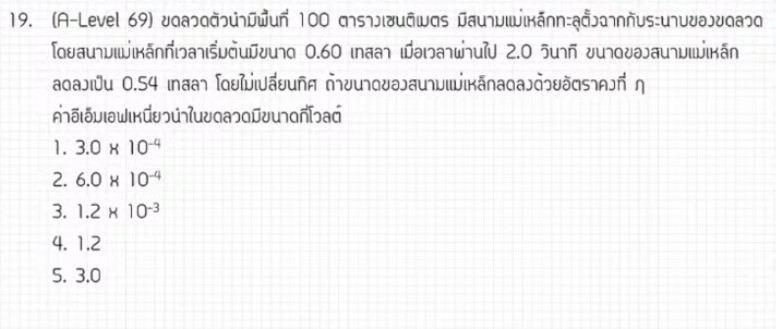

จากการวิเคราะห์ข้อสอบ A-Level ฟิสิกส์ มีนาคม 2569 **ข้อที่ 19** จากแหล่งอ้างอิงของพี่ตั้ว Physics Blueprint พบว่าเป็นเรื่อง **การเหนี่ยวนำแม่เหล็กไฟฟ้า (Faraday's Law of Induction)** ซึ่งมีรายละเอียดวิธีทำและเนื้อหาดังนี้ครับ

### **1. เฉลยวิธีทำโจทย์ข้อ 19 อย่างละเอียด**
โจทย์ข้อนี้ถามหาค่าแรงเคลื่อนไฟฟ้าเหนี่ยวนำ (EMF) ที่เกิดขึ้นในขดลวดเมื่อสนามแม่เหล็กมีการเปลี่ยนแปลงในช่วงเวลาหนึ่ง,

**ข้อมูลที่โจทย์กำหนด (วิเคราะห์จากขั้นตอนการคำนวณ):**
*   **พื้นที่ของขดลวด ($A$):** 100 ตารางเซนติเมตร หรือ $100 \times 10^{-4}$ ตารางเมตร
*   **สนามแม่เหล็กเริ่มต้น ($B_1$):** 0.60 เทสลา
*   **สนามแม่เหล็กสุดท้าย ($B_2$):** 0.54 เทสลา
*   **ช่วงเวลาที่เปลี่ยนแปลง ($\Delta t$):** 2 วินาที

**ขั้นตอนการคำนวณ:**
1.  **หาการเปลี่ยนแปลงของสนามแม่เหล็ก ($\Delta B$):**
    *   $\Delta B = |0.54 - 0.60| = 0.06$ เทสลา
2.  **ตั้งสมการแรงเคลื่อนไฟฟ้าเหนี่ยวนำ ($\varepsilon$):** ตามกฎของฟาราเดย์ แรงเคลื่อนไฟฟ้าเหนี่ยวนำคืออัตราการเปลี่ยนแปลงของฟลักซ์แม่เหล็ก
    *   $\varepsilon = \left| \frac{\Delta \Phi}{\Delta t} \right| = \frac{A \cdot \Delta B}{\Delta t}$
3.  **แทนค่าตัวเลข:**
    *   $\varepsilon = \frac{(100 \times 10^{-4}) \times 0.06}{2}$
    *   $\varepsilon = \frac{10^{-2} \times 0.06}{2}$
    *   $\varepsilon = \frac{0.0006}{2} = 0.0003 = 3 \times 10^{-4}$ โวลต์

**สรุปคำตอบ:** แรงเคลื่อนไฟฟ้าเหนี่ยวนำมีค่าเท่ากับ **$3 \times 10^{-4}$ โวลต์** (ตอบตัวเลือกที่ 1)

---

### **2. เนื้อหาเพื่อศึกษาเพิ่มเติม**
*   **กฎของฟาราเดย์ (Faraday's Law):** กล่าวว่า "ขนาดของแรงเคลื่อนไฟฟ้าเหนี่ยวนำจะแปรผันตรงกับอัตราการเปลี่ยนแปลงของฟลักซ์แม่เหล็กที่ผ่านวงจรนั้น"
*   **ฟลักซ์แม่เหล็ก ($\Phi$):** คือปริมาณเส้นแรงแม่เหล็กที่ผ่านพื้นที่หนึ่งๆ หาได้จาก $\Phi = BA \cos \theta$ หากสนามแม่เหล็กตั้งฉากกับพื้นที่ $\Phi = BA$
*   **กฎของเลนซ์ (Lenz's Law):** ใช้บอกทิศทางของกระแสเหนี่ยวนำ โดยกระแสเหนี่ยวนำจะสร้างสนามแม่เหล็กใหม่ขึ้นมาในทิศที่ "ต้าน" การเปลี่ยนแปลงของฟลักซ์แม่เหล็กเดิม (เครื่องหมายลบในสูตรเต็ม $\varepsilon = -N \frac{\Delta \Phi}{\Delta t}$),

---

### **3. กลยุทธ์แก้โจทย์ประเภทนี้**
*   **ระวังหน่วยพื้นที่:** โจทย์มักให้พื้นที่ในหน่วยตารางเซนติเมตร ($cm^2$) ต้องแปลงเป็นตารางเมตร ($m^2$) โดยคูณด้วย $10^{-4}$ เสมอ
*   **วิเคราะห์สิ่งที่เปลี่ยน:** การเปลี่ยนแปลงฟลักซ์แม่เหล็กเกิดได้จาก 3 กรณี คือ สนามแม่เหล็กเปลี่ยน ($\Delta B$), พื้นที่เปลี่ยน ($\Delta A$), หรือมุมเปลี่ยน ($\Delta \theta$) สำหรับข้อนี้คือสนามแม่เหล็กเปลี่ยน
*   **ใช้ค่าสัมบูรณ์หาขนาด:** หากโจทย์ถามแค่ขนาดของแรงเคลื่อนไฟฟ้า ไม่ต้องกังวลเรื่องเครื่องหมายลบจากการคำนวณ $\Delta B$

---

### **4. ตัวอย่างโจทย์เพิ่มเติมเพื่อฝึกทำ**

**โจทย์:** ขดลวดที่มีพื้นที่ $50 \times 10^{-4} m^2$ วางอยู่ในสนามแม่เหล็กที่สม่ำเสมอ ถ้าสนามแม่เหล็กเพิ่มขึ้นจาก $0.2$ เทสลา เป็น $0.8$ เทสลา ภายในเวลา $0.3$ วินาที จงหาแรงเคลื่อนไฟฟ้าเหนี่ยวนำเฉลี่ยที่เกิดขึ้น

**วิธีคิด:**
1.  **หา $\Delta B$:** $0.8 - 0.2 = 0.6$ T
2.  **แทนค่าในสูตร:** $\varepsilon = \frac{A \cdot \Delta B}{\Delta t}$
3.  **คำนวณ:** $\varepsilon = \frac{(50 \times 10^{-4}) \times 0.6}{0.3}$
4.  **ผลลัพธ์:** $\varepsilon = \frac{50 \times 10^{-4} \times 2} = 100 \times 10^{-4} = \mathbf{10^{-2}}$ **โวลต์** (หรือ 0.01 V)

*(หมายเหตุ: การวิเคราะห์ขั้นตอนและเทคนิคการคำนวณอ้างอิงตามแนวทางการสอนของพี่ตั้ว Physics Blueprint ซึ่งระบุว่าโจทย์แนวนี้ออกสอบต่อเนื่องมา 3 ปีแล้วและถือเป็นข้อเก็บคะแนนที่ไม่ยากจนเกินไป)*,