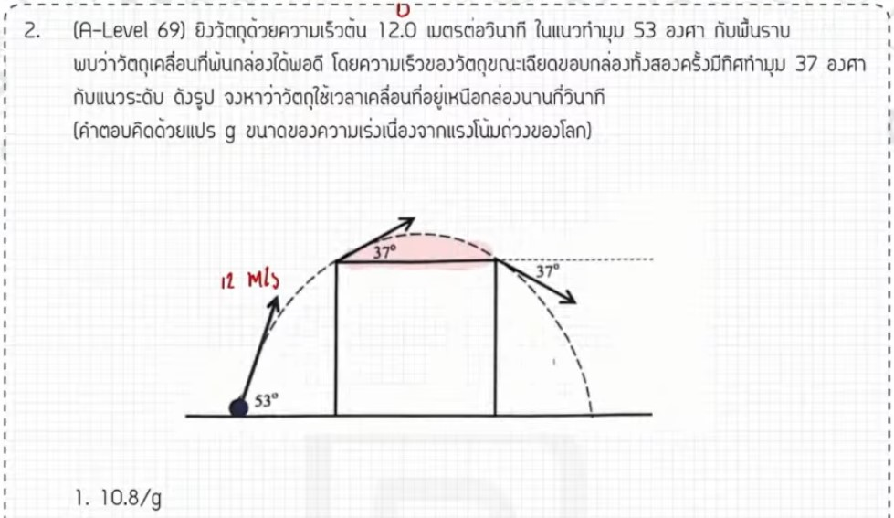

จากการวิเคราะห์ข้อสอบ A-Level ฟิสิกส์ มีนาคม 2569 ข้อที่ 2 จากแหล่งอ้างอิงที่กำหนด มีรายละเอียดวิธีทำและเนื้อหาที่น่าศึกษาดังนี้ครับ

### **1. เฉลยวิธีทำโจทย์ข้อ 2 อย่างละเอียด**
โจทย์ข้อนี้เป็นเรื่อง **การเคลื่อนที่แบบโปรเจกไทล์ (Projectile Motion)** โดยกำหนดความเร็วต้น ($u$) มาให้ และต้องการให้หาช่วงเวลาในการเคลื่อนที่ขึ้นและลงในส่วนที่โจทย์กำหนด (ช่วงที่ไฮไลท์ในข้อสอบ)

**ขั้นตอนการคำนวณ:**
1.  **หาความเร็วในแนวราบ ($u_x$):** เนื่องจากในการเคลื่อนที่แบบโปรเจกไทล์ ความเร็วในแนวราบจะคงที่เสมอ
    *   จากโจทย์ $u = 12$ m/s และใช้มุม $53^\circ$ ในการแตกแรง
    *   $u_x = u \cos 53^\circ = 12 \times (3/5) = 7.2$ m/s
2.  **หาความเร็วในแนวดิ่ง ณ จุดที่สนใจ ($u_y$):** โจทย์ระบุตำแหน่งที่มีมุมกระทำ $37^\circ$ โดยเราทราบว่าความเร็วแนวราบยังคงเป็น $7.2$ m/s
    *   ใช้ความสัมพันธ์ $\tan 37^\circ = u_y / u_x$
    *   $3/4 = u_y / 7.2$
    *   จะได้ $u_y = (3 \times 7.2) / 4 = 5.4$ m/s
3.  **คำนวณหาช่วงเวลา ($t$):** ใช้สูตรลัดสำหรับหาเวลาขึ้นและลงรวมกันคือ $t = 2u_y / g$
    *   $t = (2 \times 5.4) / 10$ (กำหนดให้ $g \approx 10$ m/s²)
    *   $t = 10.8 / 10 = \mathbf{1.08}$ **วินาที**
    *   **คำตอบ:** ตอบตัวเลือกที่ 1

---

### **2. เนื้อหาเพื่อศึกษาเพิ่มเติม**
*   **ความเป็นอิสระของการเคลื่อนที่:** การเคลื่อนที่แบบโปรเจกไทล์เป็นการเคลื่อนที่ 2 มิติที่แนวราบ (ความเร็วคงที่, $a=0$) และแนวดิ่ง (ความเร่งคงที่จากแรงโน้มถ่วง, $a=g$) ไม่ขึ้นต่อกันแต่เกิดขึ้นพร้อมกัน
*   **ความเร็ว ณ จุดสูงสุด:** ณ จุดสูงสุดของการเคลื่อนที่ ความเร็วในแนวดิ่ง ($v_y$) จะเป็น **0** เสมอ แต่ความเร็วในแนวราบ ($v_x$) จะยังคงเท่ากับ $u_x$
*   **การแตกแรงด้วยตรีโกณมิติ:** การจดจำค่า $\sin, \cos, \tan$ ของมุมยอดนิยมอย่าง $37^\circ$ และ $53^\circ$ มีความสำคัญมากในการทำข้อสอบฟิสิกส์

---

### **3. กลยุทธ์แก้โจทย์ประเภทนี้**
*   **ใช้ความเร็วแนวราบเป็นตัวเชื่อม:** เนื่องจาก $v_x$ คงที่ตลอดการเคลื่อนที่ มักจะถูกใช้เป็นตัวแปรหลักในการหาค่าอื่นๆ ในตำแหน่งต่างๆ ของเส้นโค้งโปรเจกไทล์
*   **แม่นยำเรื่องสูตรลัด:** การจำสูตรลัด เช่น $t = 2u_y / g$ ช่วยประหยัดเวลาในห้องสอบได้มาก แทนที่จะต้องตั้งสมการการเคลื่อนที่เต็มรูปแบบ
*   **ตรวจสอบเงื่อนไขโจทย์:** ต้องระวังว่าโจทย์ถาม "เวลาทั้งหมด" หรือ "เวลาเฉพาะช่วง" เพื่อเลือกค่า $u_y$ มาแทนในสูตรให้ถูกต้อง

---

### **4. ตัวอย่างโจทย์เพิ่มเติมเพื่อฝึกทำ**
**โจทย์:** ลูกบอลถูกขว้างออกจากพื้นด้วยความเร็วต้น $20$ m/s ทำมุม $30^\circ$ กับแนวราบ จงหาเวลาทั้งหมดที่ลูกบอลใช้ในการเคลื่อนที่จนกระทั่งตกถึงพื้น (กำหนดให้ $g = 10$ m/s²)

**วิธีคิด:**
1.  **หา $u_y$:** $u_y = u \sin 30^\circ = 20 \times 0.5 = 10$ m/s
2.  **ใช้สูตรเวลา:** $t = 2u_y / g$
3.  **คำนวณ:** $t = (2 \times 10) / 10 = \mathbf{2}$ **วินาที**

*(หมายเหตุ: วิธีการคำนวณและขั้นตอนต่างๆ อ้างอิงตามแนวทางการสอนและเฉลยจากแหล่งอ้างอิงที่ได้รับ,)*