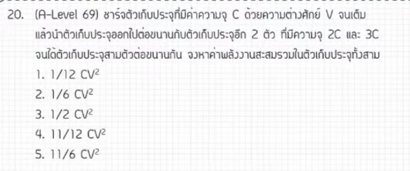

จากการวิเคราะห์ข้อสอบ A-Level ฟิสิกส์ มีนาคม 2569 **ข้อที่ 20** จากแหล่งอ้างอิงของพี่ตั้ว Physics Blueprint พบว่าเป็นเรื่อง **ไฟฟ้าสถิต (ตัวเก็บประจุและการถ่ายเทประจุ)** ซึ่งเป็นโจทย์แนวคลาสสิกที่เคยออกในข้อสอบ Entrance ยุคเก่าแล้วนำกลับมาออกใหม่อีกครั้ง มีรายละเอียดดังนี้ครับ

### **1. เฉลยวิธีทำโจทย์ข้อ 20 อย่างละเอียด**
โจทย์ข้อนี้กล่าวถึงตัวเก็บประจุหลายตัว โดยตัวแรกมีประจุสะสมอยู่ ส่วนตัวอื่นๆ ยังไม่มีประจุ เมื่อนำมาต่อขนานกัน ประจุจะเกิดการถ่ายเทจนสมดุล

**ข้อมูลที่โจทย์กำหนด:**
*   **ตอนเริ่มต้น:** มีตัวเก็บประจุ $C$ ตัวหนึ่งถูกชาร์จจนมีความต่างศักย์ $V$ จะมีประจุสะสมคือ $Q = CV$
*   **ตอนหลัง:** นำตัวเก็บประจุ $C$ ตัวเดิมไปต่อขนานกับตัวเก็บประจุตัวอื่นๆ (ในที่นี้คือ $2C$ และ $3C$ ตามที่ระบุในวิธีคิด)
*   **ตัวเก็บประจุรวม ($C_{total}$):** เมื่อต่อขนานกัน $C_{total} = C + 2C + 3C = 6C$

**ขั้นตอนการคำนวณ:**
1.  **ใช้กฎการอนุรักษ์ประจุ:** ประจุรวมก่อนต่อและหลังต่อต้องเท่าเดิม ($Q_{ก่อน} = Q_{หลัง}$)
    *   จะได้ $Q_{รวม} = CV$
2.  **หาพลังงานรวมหลังการถ่ายเท ($U$):** เนื่องจากเราทราบประจุรวม ($Q$) และความจุรวม ($C_{total}$) จึงควรใช้สูตร $U = \frac{1}{2} \frac{Q^2}{C}$
    *   $U_{หลัง} = \frac{1}{2} \cdot \frac{(CV)^2}{6C}$
3.  **จัดรูปสมการ:**
    *   $U_{หลัง} = \frac{1}{2} \cdot \frac{C^2 V^2}{6C}$
    *   ตัด $C$ ออกหนึ่งตัว จะได้ $U_{หลัง} = \frac{1}{12} CV^2$

**สรุปคำตอบ:** พลังงานรวมของระบบหลังต่อขนานมีค่าเท่ากับ **$\frac{1}{12} CV^2$** (ตอบตัวเลือกที่ 1)

---

### **2. เนื้อหาเพื่อศึกษาเพิ่มเติม**
*   **ตัวเก็บประจุต่อขนาน:** ความจุไฟฟ้าโดยรวมจะเพิ่มขึ้นเสมอ โดย $C_{total} = C_1 + C_2 + C_3 + ...$ และความต่างศักย์ ($V$) ของทุกตัวจะเท่ากัน
*   **การถ่ายเทประจุ:** เมื่อนำตัวเก็บประจุมาต่อกัน ประจุจะไหลจากตัวที่มีศักย์ไฟฟ้าสูงไปต่ำจนกระทั่งศักย์ไฟฟ้าเท่ากันจึงหยุดไหล โดยประจุรวมในระบบจะคงเดิมเสมอ,
*   **พลังงานในตัวเก็บประจุ ($U$):** มี 3 สูตรหลักที่เลือกใช้ตามตัวแปรที่ทราบค่า คือ $U = \frac{1}{2}CV^2 = \frac{1}{2}QV = \frac{1}{2}\frac{Q^2}{C}$
*   **การสูญเสียพลังงาน:** ในสภาวะจริง พลังงานรวมหลังการถ่ายเทประจุมักจะ **ลดลง** เสมอ แม้ไม่มีตัวต้านทานในวงจร เพราะพลังงานบางส่วนจะสูญเสียไปกับการแผ่คลื่นแม่เหล็กไฟฟ้าขณะประจุเคลื่อนที่,

---

### **3. กลยุทธ์แก้โจทย์ประเภทนี้**
*   **ยึดหลัก "ประจุคงที่":** ในระบบที่ไม่มีการต่อกับแหล่งกำเนิดไฟฟ้าภายนอกเพิ่มเติม ประจุรวม ($Q$) คือสิ่งที่ปลอดภัยที่สุดในการใช้เป็นตัวตั้งต้นคำนวณ
*   **มองภาพเป็น "ถังน้ำ":** พี่ตั้วแนะนำให้มองตัวเก็บประจุเหมือนถังน้ำ การต่อขนานคือการเปิดวาล์วให้ระดับน้ำ (ศักย์ไฟฟ้า) เท่ากัน โดยที่ปริมาณน้ำรวม (ประจุ) ยังเท่าเดิม
*   **เลือกสูตรพลังงานให้ถูก:** หากทราบว่า $Q$ คงที่ การใช้สูตร $U = \frac{1}{2} \frac{Q^2}{C}$ จะทำให้คำนวณได้รวดเร็วและลดโอกาสผิดพลาดจากการหาค่า $V$ ใหม่

---

### **4. ตัวอย่างโจทย์เพิ่มเติมเพื่อฝึกทำ**

**โจทย์:** ตัวเก็บประจุความจุ $2\mu F$ ชาร์จจนมีความต่างศักย์ $10V$ จากนั้นนำไปต่อขนานกับตัวเก็บประจุความจุ $3\mu F$ ที่ยังไม่มีประจุ พลังงานรวมของระบบหลังการต่อจะเป็นกี่ไมโครจูล ($\mu J$)?

**วิธีคิด:**
1.  **หาประจุเริ่มต้น ($Q$):** $Q = CV = 2\mu F \times 10V = 20\mu C$
2.  **หาความจุรวม ($C_{total}$):** $2\mu F + 3\mu F = 5\mu F$
3.  **หาพลังงานใหม่ ($U$):** $U = \frac{1}{2} \frac{Q^2}{C_{total}} = \frac{1}{2} \cdot \frac{(20 \times 10^{-6})^2}{5 \times 10^{-6}}$
4.  **คำนวณ:** $U = \frac{1}{2} \cdot \frac{400 \times 10^{-12}}{5 \times 10^{-6}} = \frac{1}{2} \cdot (80 \times 10^{-6}) = 40 \times 10^{-6} J$

**เฉลย:** พลังงานรวมใหม่คือ **40 ไมโครจูล** (สังเกตว่าพลังงานเริ่มต้นคือ $\frac{1}{2} \cdot 2\mu F \cdot (10V)^2 = 100 \mu J$ พลังงานจึงหายไป $60 \mu J$)