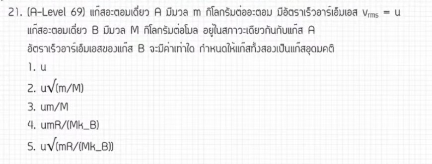

# A-Level ฟิสิกส์ 2569 ข้อที่ 21 - ทฤษฎีจลน์ของแก๊ส

จากการวิเคราะห์ข้อสอบ A-Level ฟิสิกส์ มีนาคม 2569 **ข้อที่ 21** จากแหล่งอ้างอิงของพี่ตั้ว Physics Blueprint พบว่าเป็นเรื่อง **ทฤษฎีจลน์ของแก๊ส (ความเร็วรากที่สองของกำลังสองเฉลี่ย - $v_{rms}$)** ซึ่งโจทย์ข้อนี้มีความ "เหลี่ยม" หรือจุดหลอกในเรื่องของตัวแปรมวล มีรายละเอียดดังนี้ครับ

## 1. เฉลยวิธีทำโจทย์ข้อ 21 อย่างละเอียด

โจทย์ข้อนี้เปรียบเทียบความเร็ว $v_{rms}$ ของแก๊สสองชนิด (A และ B) ที่อุณหภูมิเดียวกัน แต่กำหนดตัวแปรมวลมาให้ในรูปแบบที่ต่างกัน

**ข้อมูลที่โจทย์กำหนด:**
*   **แก๊ส A:** มีมวลต่ออะตอมคือ $m$ และความเร็ว $v_{rms}$ เท่ากับ $u$
*   **แก๊ส B:** มีมวลโมลาร์คือ $M$
*   **เงื่อนไข:** ทั้งสองแก๊สมีอุณหภูมิ $T$ เท่ากัน

**ขั้นตอนการคำนวณ:**
1.  **เลือกใช้สูตร $v_{rms}$ ให้ตรงกับตัวแปร:**
    *   สำหรับแก๊ส A (ใช้มวลต่ออะตอม $m$): $v_A = u = \sqrt{\frac{3k_B T}{m}}$
    *   สำหรับแก๊ส B (ใช้มวลโมลาร์ $M$): $v_B = \sqrt{\frac{3RT}{M}}$
2.  **หาอัตราส่วน $\frac{v_B}{v_A}$:**
    *   $\frac{v_B}{u} = \frac{\sqrt{\frac{3RT}{M}}}{\sqrt{\frac{3k_B T}{m}}}$
3.  **จัดรูปสมการโดยการรวมเครื่องหมายราก (Square root):**
    *   $\frac{v_B}{u} = \sqrt{\frac{3RT}{M} \cdot \frac{m}{3k_B T}}$
4.  **ตัดตัวแปรที่เหมือนกัน (3 และ $T$):**
    *   $\frac{v_B}{u} = \sqrt{\frac{Rm}{Mk_B}}$
5.  **หาความเร็ว $v_B$:**
    *   $v_B = u\sqrt{\frac{mR}{Mk_B}}$

**สรุปคำตอบ:** ตอบตัวเลือกที่ตรงกับค่า **$u\sqrt{\frac{mR}{Mk_B}}$**

---

### **2. เนื้อหาเพื่อศึกษาเพิ่มเติม**
*   **ความเร็ว $v_{rms}$:** มี 3 รูปแบบหลักที่ควรจำเพื่อใช้ตามสถานการณ์:
    1.  $v_{rms} = \sqrt{\frac{3P}{\rho}}$ (เมื่อทราบความดันและความหนาแน่น)
    2.  $v_{rms} = \sqrt{\frac{3k_B T}{m}}$ (เมื่อทราบมวลต่อโมเลกุล/อะตอม)
    3.  $v_{rms} = \sqrt{\frac{3RT}{M}}$ (เมื่อทราบมวลโมลาร์)
*   **ความสัมพันธ์ของค่าคงตัว:** $R = N_A k_B$ และ $M = N_A m$ ซึ่ง $N_A$ คือเลขอาโวกาโดร
*   **พลังงานจลน์เฉลี่ย:** $E_k = \frac{3}{2}k_B T = \frac{1}{2}mv_{rms}^2$ ซึ่งแสดงว่าที่อุณหภูมิเดียวกัน แก๊สที่มีมวลน้อยกว่าจะมีความเร็วเฉลี่ยสูงกว่า

---

### **3. กลยุทธ์แก้โจทย์ประเภทนี้**
*   **ระวังหน่วยของมวล:** จุดหลอกที่สำคัญที่สุดคือการสลับกันระหว่าง **มวลต่ออะตอม ($m$)** ซึ่งต้องคู่กับ **ค่าคงตัวโบลต์ซมันน์ ($k_B$)** และ **มวลโมลาร์ ($M$)** ซึ่งต้องคู่กับ **ค่าคงตัวแก๊ส ($R$)**
*   **การพิสูจน์สูตร:** หากจำสูตรไม่ได้ในห้องสอบ ให้เริ่มจากพลังงานจลน์เฉลี่ย $\frac{1}{2}mv^2 = \frac{3}{2}k_B T$ แล้วค่อย ๆ จัดรูป จะช่วยให้มั่นใจว่าตัวแปรไหนอยู่บนหรือล่าง
*   **เปรียบเทียบด้วยอัตราส่วน:** เมื่อโจทย์ถาม "เป็นกี่เท่า" หรือให้หาค่าในรูปตัวแปรอื่น การตั้งสมการหารกันจะช่วยตัดตัวแปรที่คงที่ออกไปได้รวดเร็วที่สุด

---

### **4. ตัวอย่างโจทย์เพิ่มเติมเพื่อฝึกทำ**

**โจทย์:** แก๊สชนิดหนึ่งมีความเร็ว $v_{rms}$ เท่ากับ $v$ ที่อุณหภูมิ $T$ หากเพิ่มอุณหภูมิเป็น $4T$ ความเร็ว $v_{rms}$ ใหม่จะเป็นกี่เท่าของเดิม?

**วิธีคิด:**
1.  **วิเคราะห์ความสัมพันธ์:** จาก $v_{rms} = \sqrt{\frac{3RT}{M}}$ จะเห็นว่า $v \propto \sqrt{T}$
2.  **ตั้งสมการเปรียบเทียบ:** $\frac{v_{ใหม่}}{v_{เดิม}} = \sqrt{\frac{T_{ใหม่}}{T_{เดิม}}}$
3.  **แทนค่า:** $\frac{v_{ใหม่}}{v} = \sqrt{\frac{4T}{T}} = \sqrt{4} = 2$
4.  **คำตอบ:** ความเร็วใหม่จะเป็น **2 เท่า** ของความเร็วเดิม

*(หมายเหตุ: การวิเคราะห์ขั้นตอนและเทคนิคการจัดรูปตัวแปรอ้างอิงตามแนวทางการสอนของพี่ตั้ว Physics Blueprint จากแหล่งอ้างอิงที่ได้รับ)*