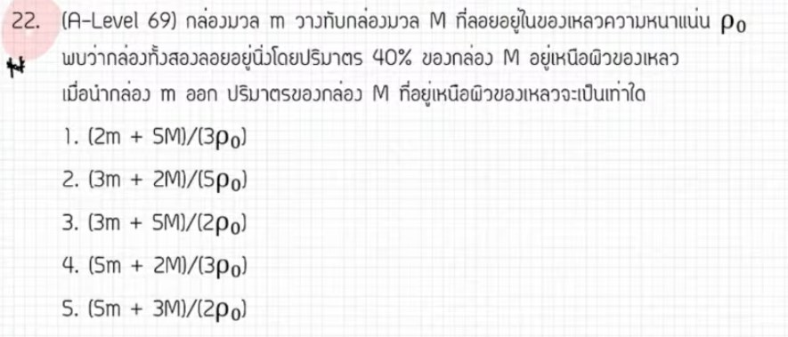

# A-Level ฟิสิกส์ มีนาคม 2569 ข้อที่ 22 - ของไหล (แรงลอยตัวและหลักของอาร์คิมีดีส)

จากการวิเคราะห์ข้อสอบ A-Level ฟิสิกส์ มีนาคม 2569 **ข้อที่ 22** จากแหล่งอ้างอิงของพี่ตั้ว Physics Blueprint พบว่าเป็นเรื่อง **ของไหล (แรงลอยตัวและหลักของอาร์คิมีดีส)** ซึ่งถือเป็นข้อที่อยู่ในระดับยาก (**Hard Mode**) เนื่องจากต้องใช้ทักษะการจัดรูปตัวแปรที่ซับซ้อน, โดยมีรายละเอียดดังนี้ครับ

## **1. เฉลยวิธีทำโจทย์ข้อ 22 อย่างละเอียด**

โจทย์ข้อนี้เป็นสถานการณ์ของกล่องที่ลอยในของเหลว โดยมีการเปลี่ยนมวลที่บรรจุอยู่ภายใน แล้วถามหาปริมาตรส่วนที่ลอยพ้นของเหลวในสภาวะหลัง,

**ข้อมูลที่โจทย์กำหนด (ในรูปตัวแปร):**

* **สภาวะแรก:** มีมวลรวมคือ $M + m$ ลอยโดยมีส่วนพ้นของเหลว 40% (นั่นคือ **ส่วนจมเท่ากับ 60%** ของปริมาตรกล่อง $V$)
* **สภาวะหลัง:** นำมวล $m$ ออก เหลือเพียงมวล $M$
* **ความหนาแน่นของเหลว:** $\rho_0$
* **สิ่งที่โจทย์ถาม:** ปริมาตรส่วนที่ลอยพ้นของเหลวในสภาวะหลัง ($V_{ลอย}$)

**ขั้นตอนการคำนวณ:**

1. **วิเคราะห์สภาวะแรก (สมดุลแรงลอยตัว):** แรงลอยตัวเท่ากับน้ำหนักรวม
    * $F_B = W_{total}$
    * $\rho_0 V_{จม} g = (M + m)g$
    * $\rho_0 (0.6V) = M + m$ (ใช้ 0.6 เพราะจม 60%)
    * จะได้ปริมาตรกล่องทั้งหมด $V = \frac{M + m}{0.6\rho_0} = \frac{5(M + m)}{3\rho_0}$ — (สมการที่ 1)
2. **วิเคราะห์สภาวะหลัง (เหลือมวล $M$):**
    * $F'_B = Mg$
    * $\rho_0 V'_{จม} = M$
    * เรารู้ว่า $V'_{จม} = V - V_{ลอย}$ ดังนั้น $\rho_0 (V - V_{ลอย}) = M$
3. **แก้สมการหา $V_{ลอย}$:**
    * $\rho_0 V_{ลอย} = \rho_0 V - M$
    * แทนค่า $V$ จากสมการที่ 1: $\rho_0 V_{ลอย} = \rho_0 \left[ \frac{5(M + m)}{3\rho_0} \right] - M$
    * $\rho_0 V_{ลอย} = \frac{5M + 5m}{3} - M = \frac{5M + 5m - 3M}{3}$
    * $\rho_0 V_{ลอย} = \frac{2M + 5m}{3}$
    * $V_{ลอย} = \frac{5m + 2M}{3\rho_0}$

**สรุปคำตอบ:** ตอบตัวเลือกที่ 4 คือ **$\frac{5m + 2M}{3\rho_0}$**

---

### **2. เนื้อหาเพื่อศึกษาเพิ่มเติม**

* **หลักของอาร์คิมีดีส (Archimedes' Principle):** แรงลอยตัวที่กระทำต่อวัตถุมีค่าเท่ากับน้ำหนักของของเหลวที่ถูกวัตถุนั้นแทนที่ ($F_B = \rho_{liquid} V_{submerged} g$)
* **เงื่อนไขการลอย:** วัตถุจะลอยนิ่งได้เมื่อแรงลอยตัวมีขนาดเท่ากับน้ำหนักของวัตถุทั้งก้อนพอดี โดยไม่จำเป็นต้องจมมิดทั้งก้อน
* **ความสัมพันธ์ของเปอร์เซ็นต์ส่วนจม:** ส่วนจมแปรผันตรงกับน้ำหนักรวมของวัตถุ หากน้ำหนักลดลง ส่วนจมจะลดลง (ส่วนที่ลอยพ้นน้ำจะเพิ่มขึ้น)

---

### **3. กลยุทธ์แก้โจทย์ประเภทนี้**

* **อย่าโดนหลอกเรื่องเปอร์เซ็นต์:** โจทย์มักให้ "ส่วนที่ลอยพ้น" มา แต่ในการคำนวณแรงลอยตัวเราต้องใช้ **"ส่วนที่จม"** เสมอ (เช่น ลอย 40% แปลว่าจม 60%)
* **ตั้งสมการสองสภาวะ:** เริ่มจากสภาวะที่ข้อมูลครบเพื่อหาค่าคงที่หรือปริมาตรรวม ($V$) ออกมาก่อน แล้วจึงนำไปใช้ในสภาวะที่โจทย์ถาม
* **ทักษะการจัดรูปเศษส่วน:** โจทย์แนวนี้วัดความแม่นยำในการบวกลบเศษส่วนตัวแปร การทำส่วนให้เท่ากันก่อนย้ายข้างจะช่วยลดความผิดพลาดได้มาก

---

### **4. ตัวอย่างโจทย์เพิ่มเติมเพื่อฝึกทำ**

**โจทย์:** กล่องปริมาตร $V$ ลอยในน้ำที่มีความหนาแน่น $\rho$ โดยจมลงไป 80% ของปริมาตรกล่อง เมื่อวางวัตถุมวล $m$ ทับบนกล่อง พบว่ากล่องจมลงไปพอดีมิดผิวพรรณพอดี จงหามวลของกล่องในรูปของตัวแปร $m$

**วิธีคิด:**

1. **สภาวะแรก (กล่องเปล่า):** ให้กล่องมวล $M$
    * $\rho (0.8V) = M$ — (1)
2. **สภาวะหลัง (วางมวล $m$):** จมมิดพอดีแปลว่า $V_{จม} = V$
    * $\rho V = M + m$ — (2)
3. **แก้สมการ:** จาก (1) จะได้ $V = \frac{M}{0.8\rho}$ แทนใน (2)
    * $\rho \left( \frac{M}{0.8\rho} \right) = M + m$
    * $\frac{M}{0.8} = M + m \Rightarrow 1.25M = M + m$
    * $0.25M = m \Rightarrow M = 4m$
**คำตอบ:** มวลของกล่องเท่ากับ **$4m$**

*(หมายเหตุ: การวิเคราะห์ขั้นตอนการจัดรูปตัวแปรและกลยุทธ์การทำโจทย์อ้างอิงตามแนวทางการสอนของพี่ตั้ว Physics Blueprint จากแหล่งอ้างอิงที่ได้รับ)*,
