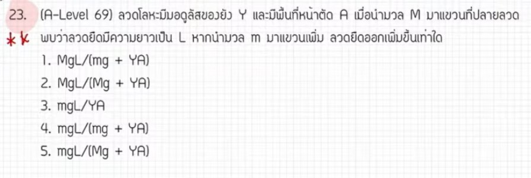

# ข้อ 23 A-Level ฟิสิกส์ มีนาคม 2569

จากการวิเคราะห์ข้อสอบ A-Level ฟิสิกส์ มีนาคม 2569 **ข้อที่ 23** จากแหล่งอ้างอิงของพี่ตั้ว Physics Blueprint พบว่าเป็นเรื่อง **สมบัติเชิงกลของของแข็ง (สภาพยืดหยุ่นและมอดุลัสของยัง)** ซึ่งถือเป็นข้อที่ต้องใช้ทักษะการจัดรูปตัวแปรที่ซับซ้อนมากที่สุดข้อหนึ่งในชุดนี้, โดยมีรายละเอียดดังนี้ครับ

## **1. เฉลยวิธีทำโจทย์ข้อ 23 อย่างละเอียด**

โจทย์ข้อนี้กล่าวถึงลวดเส้นหนึ่งที่ถูกยืดออกด้วยมวลค่าหนึ่งจนมีความยาวเป็น $L$ จากนั้นเมื่อเพิ่มมวลเข้าไปอีก $m$ ถามว่าลวดจะยืดออกเพิ่มจากเดิมเท่าใด,

**ข้อมูลที่โจทย์กำหนด (ในรูปตัวแปร):**

* **ความยาวธรรมชาติเริ่มต้น:** $L_0$ (โจทย์ไม่ได้ให้มาในคำตอบสุดท้าย แต่ต้องใช้ในการคำนวณ)
* **สถานะที่ 1:** ลวดถูกยืดออกด้วยมวล $M$ จนมีความยาวรวมเป็น $L$,
* **สถานะที่ 2:** เพิ่มมวลเข้าไปอีก $m$ (มวลรวมเป็น $M+m$)
* **สิ่งที่โจทย์ถาม:** ระยะที่ยืดเพิ่มขึ้น ($\Delta L_2$) เมื่อเทียบกับความยาว $L$

**ขั้นตอนการคำนวณ:**

1. **ตั้งสมการความสัมพันธ์พื้นฐาน:** จากสูตรมอดุลัสของยัง $Y = \frac{FL_0}{A \Delta L}$ จะได้ระยะยืด $\Delta L = \frac{FL_0}{YA}$
2. **วิเคราะห์สถานะที่ 1 เพื่อหา $L_0$:**
    * ความยาวรวม $L = L_0 + \Delta L_1$
    * แทนค่าระยะยืดจากมวล $M$: $L = L_0 + \frac{MgL_0}{YA}$
    * จัดรูปหา $L_0$: $L = L_0(1 + \frac{Mg}{YA}) = L_0(\frac{YA + Mg}{YA})$
    * จะได้ $L_0 = \frac{LYA}{YA + Mg}$ — (สมการที่ 1)
3. **วิเคราะห์ระยะที่ยืดเพิ่มจากมวล $m$ ($\Delta L_2$):**
    * ระยะยืดที่เพิ่มขึ้นเกิดจากแรงของมวล $m$ ที่เพิ่มเข้ามา: $\Delta L_2 = \frac{mgL_0}{YA}$
4. **แทนค่า $L_0$ จากสมการที่ 1 ลงในสมการระยะยืดเพิ่ม:**
    * $\Delta L_2 = \frac{mg}{YA} \times \left( \frac{LYA}{YA + Mg} \right)$
    * ตัดตัวแปร $YA$ ทั้งเศษและส่วน
    * จะได้ผลลัพธ์สุดท้ายคือ $\Delta L_2 = \frac{mgL}{YA + Mg}$

**สรุปคำตอบ:** ระยะที่ยืดเพิ่มขึ้นมีค่าเท่ากับ **$\frac{mgL}{YA + Mg}$** (ตอบตัวเลือกที่ 5)

---

### **2. เนื้อหาเพื่อศึกษาเพิ่มเติม**

* **มอดุลัสของยัง (Young's Modulus):** เป็นค่าคงที่เฉพาะตัวของวัสดุที่บอกถึงความสามารถในการต้านทานการเปลี่ยนแปลงความยาวเมื่อได้รับแรงดึงหรือแรงอัด
* **ความเค้นและความเครียด:** ความเค้น ($\sigma = F/A$) คือแรงต่อพื้นที่ และความเครียด ($\varepsilon = \Delta L / L_0$) คือสัดส่วนระยะที่เปลี่ยนไปต่อความยาวเดิม
* **จุดควรระวัง:** ระยะยืด ($\Delta L$) ต้องเทียบกับความยาวธรรมชาติ ($L_0$) เสมอ แต่ข้อนี้ความยากอยู่ที่โจทย์ต้องการคำตอบติดในรูปความยาวที่ถูกยืดแล้ว ($L$) จึงต้องมีการแทนค่าตัวแปรย้อนกลับ,

---

### **3. กลยุทธ์แก้โจทย์ประเภทนี้**

* **ตรวจสอบตัวแปรในตัวเลือก:** หากในตัวเลือกไม่มีตัวแปรใด (เช่น ไม่มี $L_0$) แสดงว่าเราต้องตั้งสมการเพื่อกำจัดตัวแปรนั้นออกไป
* **แยกคิดผลของแรงที่เพิ่มขึ้น:** ในเรื่องสภาพยืดหยุ่น ระยะยืดที่เพิ่มขึ้นจะแปรผันตรงกับแรงที่เพิ่มเข้ามาใหม่โดยตรง (หากยังไม่เกินขีดจำกัดการแปรผันตรง) การคิดเฉพาะแรง $mg$ ที่เพิ่มขึ้นจะช่วยให้ตั้งสมการได้ง่ายกว่าการคิดมวลรวม
* **ทักษะการจัดรูปพีชคณิต:** โจทย์แนวนี้วัดความแม่นยำในการย้ายข้างและดึงตัวร่วมค่อนข้างสูง ควรฝึกการจัดการเศษส่วนซ้อนให้คล่องแคล่ว

---

### **4. ตัวอย่างโจทย์เพิ่มเติมเพื่อฝึกทำ**

**โจทย์:** ลวดโลหะเส้นหนึ่งมีความยาว $L$ เมื่อแขวนมวล $M$ ไว้ที่ปลาย ถ้าต้องการให้ลวดยืดออกเพิ่มขึ้นอีก $1\%$ ของความยาว $L$ จะต้องเพิ่มมวลเข้าไปอีกเท่าใด (ติดในรูปตัวแปร $M, Y, A$ และ $g$)

**วิธีคิด:**

1. **หาระยะยืดเพิ่มที่ต้องการ:** $\Delta L_{เพิ่ม} = 0.01L$
2. **ใช้สูตรจากข้อ 23:** $\Delta L_{เพิ่ม} = \frac{m_{เพิ่ม}gL}{YA + Mg}$
3. **แทนค่าและหา $m_{เพิ่ม}$:** $0.01L = \frac{m_{เพิ่ม}gL}{YA + Mg}$
4. **คำตอบ:** $m_{เพิ่ม} = \frac{0.01(YA + Mg)}{g}$

## **5. หมายเหตุเพิ่มเติม**

การวิเคราะห์ขั้นตอนการจัดรูปตัวแปรและเทคนิคการทำโจทย์อ้างอิงตามแนวทางการสอนของพี่ตั้ว Physics Blueprint ซึ่งระบุว่าข้อนี้เป็นข้อที่ใช้เวลาทำนานและต้องรอบคอบในการจัดรูปมากที่สุดข้อหนึ่ง
