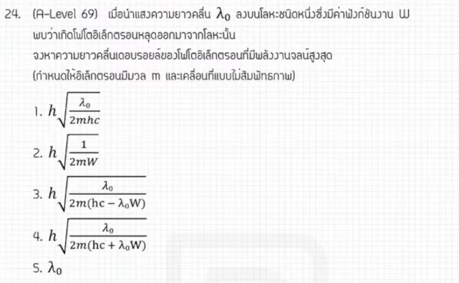

# A-Level ฟิสิกส์ มีนาคม 2569 ข้อที่ 24

จากการวิเคราะห์ข้อสอบ A-Level ฟิสิกส์ มีนาคม 2569 **ข้อที่ 24** จากแหล่งอ้างอิงของพี่ตั้ว Physics Blueprint พบว่าเป็นเรื่อง **ฟิสิกส์ควอนตัม** ที่เป็นการผสมผสานระหว่าง **ปรากฏการณ์โฟโตอิเล็กทริก (Photoelectric Effect)** และ **สมมติฐานของเดอบรอยล์ (de Broglie Hypothesis)** มีรายละเอียดดังนี้ครับ

## **1. เฉลยวิธีทำโจทย์ข้อ 24 อย่างละเอียด**

โจทย์ข้อนี้ถามหาความยาวคลื่นเดอบรอยล์ของอิเล็กตรอนที่หลุดออกมาจากแผ่นโลหะเมื่อถูกแสงตกกระทบ

**ข้อมูลที่โจทย์กำหนด (ในรูปตัวแปร):**

* **ความยาวคลื่นของแสงที่ตกกระทบ:** $\lambda_0$
* **ฟังก์ชันงานของโลหะ (Work Function):** $W$
* **มวลของอิเล็กตรอน:** $m$
* **สิ่งที่โจทย์ถาม:** ความยาวคลื่นเดอบรอยล์ ($\lambda$) ของอิเล็กตรอนที่หลุดออกมา

**ขั้นตอนการคำนวณ:**

1. **หานำพลังงานจลน์ของอิเล็กตรอน ($E_k$):** จากสมการโฟโตอิเล็กทริกของไอน์สไตน์ พลังงานของโฟตอนที่ตกกระทบจะเท่ากับฟังก์ชันงานบวกกับพลังงานจลน์สูงสุดของอิเล็กตรอน
    * $E_{photon} = W + E_k$
    * $\frac{hc}{\lambda_0} = W + E_k$
    * จะได้ $E_k = \frac{hc}{\lambda_0} - W$
2. **เชื่อมโยงกับความยาวคลื่นเดอบรอยล์:** จากสูตรความยาวคลื่นเดอบรอยล์ $\lambda = \frac{h}{p}$ โดยที่โมเมนตัม $p$ สัมพันธ์กับพลังงานจลน์คือ $p = \sqrt{2mE_k}$
    * แทนค่า $E_k$ ลงในสูตรโมเมนตัม: $p = \sqrt{2m \left( \frac{hc}{\lambda_0} - W \right)}$
3. **หาคำตอบสุดท้าย:** แทนค่า $p$ กลับเข้าไปในสมการความยาวคลื่น
    * $\lambda = \frac{h}{\sqrt{2m \left( \frac{hc}{\lambda_0} - W \right)}}$
4. **การจัดรูปตามตัวเลือก:** เพื่อให้ตรงกับช้อยส์ในข้อสอบ พี่ตั้วแนะนำให้จัดรูปภายในเครื่องหมายรากโดยหา ค.ร.น.
    * $\lambda = \frac{h}{\sqrt{\frac{2m(hc - W\lambda_0)}{\lambda_0}}} = \frac{h\sqrt{\lambda_0}}{\sqrt{2m(hc - W\lambda_0)}}$

**สรุปคำตอบ:** ความยาวคลื่นเดอบรอยล์คือ **$\frac{h\sqrt{\lambda_0}}{\sqrt{2m(hc - W\lambda_0)}}$** (ตรงกับตัวเลือกที่ 3)

---

### **2. เนื้อหาเพื่อศึกษาเพิ่มเติม**

* **ปรากฏการณ์โฟโตอิเล็กทริก:** เป็นปรากฏการณ์ที่แสงแสดงสมบัติเป็นอนุภาค (โฟตอน) เมื่อกระทบโลหะจะถ่ายเทพลังงานให้อิเล็กตรอนหลุดออกมา พลังงานจลน์จะมากหรือน้อยขึ้นอยู่กับความถี่ของแสง ไม่ใช่ความเข้มแสง
* **สมมติฐานของเดอบรอยล์:** เสนอว่าอนุภาคที่มีมวลและกำลังเคลื่อนที่สามารถแสดงสมบัติเป็นคลื่นได้ โดยความยาวคลื่นจะแปรผกผันกับโมเมนตัม
* **ความสัมพันธ์พลังงาน-โมเมนตัม:** การแปลง $E_k = \frac{1}{2}mv^2$ ให้อยู่ในรูป $p = \sqrt{2mE_k}$ เป็นเทคนิคพื้นฐานที่สำคัญมากในฟิสิกส์ระดับสูง

---

### **3. กลยุทธ์แก้โจทย์ประเภทนี้**

* **เชื่อมโยงตัวแปร:** ในโจทย์ที่ผสมสองเรื่อง ให้มองหา "ตัวแปรเชื่อม" เสมอ ในข้อนี้คือ **พลังงานจลน์ ($E_k$)** ของอิเล็กตรอนที่เชื่อมจากภาคโฟโตอิเล็กทริกไปสู่ภาคเดอบรอยล์
* **สังเกตพจน์ในตัวเลือก:** หากตัวเลือกมี $\sqrt{\lambda_0}$ อยู่ด้านบน แสดงว่ามีการจัดรูปเศษส่วนภายในเครื่องหมายรากตามขั้นตอนข้างต้น
* **ตัดช้อยส์ด้วยเครื่องหมาย:** พลังงานจลน์เกิดจากพลังงานแสง "ลบ" ด้วยฟังก์ชันงาน ดังนั้นพจน์ในสูตรต้องมีการลบกัน ($hc - W\lambda_0$) ช้อยส์ที่มีการบวกกันสามารถตัดทิ้งได้ทันที

---

### **4. ตัวอย่างโจทย์เพิ่มเติมเพื่อฝึกทำ**

**โจทย์:** อิเล็กตรอนตัวหนึ่งมีพลังงานจลน์ $K$ และมีความยาวคลื่นเดอบรอยล์เท่ากับ $\lambda$ หากพลังงานจลน์ของอิเล็กตรอนเพิ่มขึ้นเป็น $9K$ ความยาวคลื่นเดอบรอยล์ใหม่จะเป็นกี่เท่าของความยาวคลื่นเดิม?

**วิธีคิด:**

1. **วิเคราะห์ความสัมพันธ์:** จากสูตร $\lambda = \frac{h}{\sqrt{2mE_k}}$ จะเห็นว่า $\lambda \propto \frac{1}{\sqrt{E_k}}$
2. **เปรียบเทียบสภาวะ:**
    * $\frac{\lambda_{ใหม่}}{\lambda_{เดิม}} = \sqrt{\frac{E_{k, เดิม}}{E_{k, ใหม่}}}$
3. **แทนค่า:**
    * $\frac{\lambda_{ใหม่}}{\lambda} = \sqrt{\frac{K}{9K}} = \sqrt{\frac{1}{9}} = \frac{1}{3}$
4. **คำตอบ:** ความยาวคลื่นใหม่จะเป็น **$1/3$ เท่า** ของความยาวคลื่นเดิม

#### หมายเหตุ

การวิเคราะห์ขั้นตอนและเทคนิคการจัดรูปตัวแปรอ้างอิงตามแนวทางการสอนของพี่ตั้ว Physics Blueprint จากแหล่งอ้างอิงที่ได้รับ
