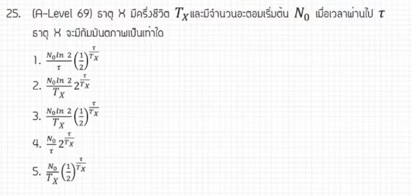

# โจทย์ข้อที่ 25 กัมมันตภาพรังสี

จากแหล่งอ้างอิงของพี่ตั้ว Physics Blueprint ข้อสอบ A-Level ฟิสิกส์ มีนาคม 2569 **ข้อที่ 25 ในส่วนของปรนัย (ที่มีตัวเลือก)** เป็นเรื่อง **กัมมันตภาพรังสี** จริงตามที่คุณระบุครับ (ส่วนข้อที่ผมทำไปก่อนหน้านี้คือข้อแรกของส่วนเติมคำตอบ ซึ่งบางแหล่งอาจเรียกว่าข้อ 25 หรือ 26),

นี่คือวิธีทำอย่างละเอียดสำหรับโจทย์ข้อ 25 เรื่องกัมมันตภาพรังสีครับ:

## **1. เฉลยวิธีทำโจทย์ข้อ 25 อย่างละเอียด**

โจทย์ข้อนี้ถามหาค่ากัมมันตภาพ ($A$) ณ เวลา $t$ ใดๆ เมื่อกำหนดจำนวนนิวเคลียสเริ่มต้นและความกึ่งชีวิตมาให้ในรูปตัวแปร

**ข้อมูลที่โจทย์กำหนด (ในรูปตัวแปร):**

* **จำนวนนิวเคลียสเริ่มต้น:** $N_0$
* **เวลาครึ่งชีวิต (Half-life):** $T$
* **เวลาที่ผ่านไป:** $t$
* **สิ่งที่โจทย์ถาม:** กัมมันตภาพ ($A$) ณ เวลา $t$

**ขั้นตอนการคำนวณ:**

1. **ตั้งสมการกัมมันตภาพพื้นฐาน:** กัมมันตภาพมีค่าเท่ากับค่าคงตัวการสลายตัว ($\lambda$) คูณด้วยจำนวนนิวเคลียสที่เหลืออยู่ ($N$) ณ เวลานั้น
    * $A = \lambda N$
2. **หาค่าคงตัวการสลายตัว ($\lambda$):** จากความสัมพันธ์กับเวลาครึ่งชีวิต
    * $\lambda = \frac{\ln 2}{T}$
3. **หาจำนวนนิวเคลียสที่เหลืออยู่ ($N$):** จากกฎการสลายตัว
    * $N = N_0 \left(\frac{1}{2}\right)^{\frac{t}{T}}$
4. **แทนค่าทั้งหมดลงในสมการกัมมันตภาพ:**
    * $A = \left( \frac{\ln 2}{T} \right) \cdot N_0 \left( \frac{1}{2} \right)^{\frac{t}{T}}$

**สรุปคำตอบ:** กัมมันตภาพ $A$ มีค่าเท่ากับ **$\frac{\ln 2}{T} N_0 \left( \frac{1}{2} \right)^{\frac{t}{T}}$** ซึ่งตรงกับ **ตัวเลือกที่ 3**

---

### **2. เนื้อหาเพื่อศึกษาเพิ่มเติม**

* **กัมมันตภาพ (Activity, $A$):** คืออัตราการสลายตัวของนิวเคลียสกัมมันตรังสีต่อหนึ่งหน่วยเวลา หน่วยมาตรฐานคือ เบ็กเคอเรล (Bq)
* **ค่าคงตัวการสลายตัว ($\lambda$):** บอกถึงโอกาสที่นิวเคลียสจะสลายตัวต่อหน่วยเวลา ยิ่งค่านี้มาก ธาตุนั้นยิ่งสลายตัวเร็ว
* **ความสัมพันธ์ของ $A$ และ $N$:** เนื่องจาก $A$ แปรผันตรงกับ $N$ ดังนั้นสมการการลดลงของ $A$ จึงมีรูปแบบเดียวกับ $N$ คือ $A = A_0 \left(\frac{1}{2}\right)^{n}$ เมื่อ $n$ คือจำนวนรอบของครึ่งชีวิต

---

### **3. กลยุทธ์แก้โจทย์ประเภทนี้**

* **จำสูตรเชื่อมโยง:** โจทย์แนวกัมมันตภาพรังสีมักจะให้เราเชื่อมระหว่าง $A, \lambda, N$ และ $T$ เสมอ หัวใจสำคัญคือต้องรู้ว่า $A = \lambda N$ และ $\lambda$ สัมพันธ์กับ $T$ อย่างไร
* **ระวังหน่วยของเวลา:** ในโจทย์ตัวแปรอาจไม่มีปัญหา แต่ในโจทย์คำนวณตัวเลข ต้องเช็คว่าหน่วยของ $\lambda$ (เช่น ต่อวินาที) สอดคล้องกับหน่วยของเวลา $t$ หรือไม่
* **มองให้ออกว่าโจทย์ถามอะไร:** โจทย์บางข้อถาม "จำนวนที่สลายไป" แต่บางข้อถาม "จำนวนที่เหลืออยู่" (กัมมันตภาพจะคิดจากจำนวนนิวเคลียสที่ **เหลืออยู่** ณ ขณะนั้น)

---

### **4. ตัวอย่างโจทย์เพิ่มเติมเพื่อฝึกทำ**

**โจทย์:** ธาตุกัมมันตรังสีชนิดหนึ่งมีกัมมันตภาพเริ่มต้น $A_0$ และมีครึ่งชีวิต 3 วัน เมื่อเวลาผ่านไป 9 วัน จะมีกัมมันตภาพเหลืออยู่เป็นกี่เท่าของ $A_0$?

**วิธีคิด:**

1. **หาจำนวนรอบของครึ่งชีวิต ($n$):** $n = \text{เวลาทั้งหมด} / \text{ครึ่งชีวิต} = 9 / 3 = 3$ รอบ
2. **ใช้สูตรการลดลงของกัมมันตภาพ:** $A = A_0 \left(\frac{1}{2}\right)^n$
3. **แทนค่า:** $A = A_0 \left(\frac{1}{2}\right)^3 = A_0 \left(\frac{1}{8}\right)$
4. **คำตอบ:** จะเหลือเป็น **$1/8$ เท่า** (หรือ 0.125 เท่า) ของเดิม

**เฉลย:** **0.125 $A_0$**
