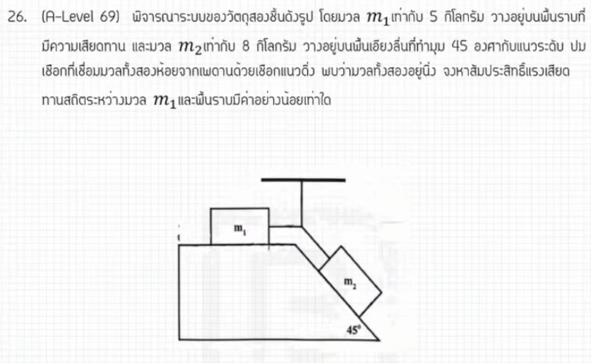

# A-Level ฟิสิกส์ มีนาคม 2569 ข้อ 26 - การแทรกสอดของแสงผ่านเกรตติง

จากการวิเคราะห์ข้อสอบ A-Level ฟิสิกส์ มีนาคม 2569 **ข้อที่ 26** จากแหล่งอ้างอิงของพี่ตั้ว Physics Blueprint พบว่าเป็นโจทย์ในส่วนของ **อัตนัย (เติมคำตอบ)** เรื่อง **การแทรกสอดของแสงผ่านเกรตติง (Diffraction Grating)** ซึ่งมีรายละเอียดและวิธีทำดังนี้ครับ

## **1. เฉลยวิธีทำโจทย์ข้อ 26 อย่างละเอียด**

โจทย์ข้อนี้ถามหาระยะห่างระหว่างแถบสว่างบนฉาก เมื่อแสงผ่านเกรตติงที่มีจำนวนช่องตามที่กำหนด

**ข้อมูลที่โจทย์กำหนด (วิเคราะห์จากขั้นตอนการคำนวณ):**

* **ลักษณะเกรตติง:** 1,000 ช่องต่อเซนติเมตร
* **ความยาวคลื่นแสง ($\lambda$):** 600 นาโนเมตร ($600 \times 10^{-9}$ เมตร หรือ $6 \times 10^{-7}$ เมตร)
* **ระยะห่างระหว่างเกรตติงกับฉาก ($L$):** 1 เมตร
* **ลำดับที่พิจารณา ($n$):** แถบสว่างลำดับที่ 2 ($n = 2$)
* **สิ่งที่โจทย์ถาม:** ระยะห่างระหว่างแถบสว่างลำดับที่ 2 ทั้งสองข้าง (จาก $+x_2$ ถึง $-x_2$)

**ขั้นตอนการคำนวณ:**

1. **หาค่าคงที่เกรตติง ($d$):** ระยะห่างระหว่างช่องเกรตติง
    * $d = \frac{1 \text{ cm}}{1,000 \text{ lines}} = \frac{10^{-2} \text{ m}}{10^3} = \mathbf{10^{-5}}$ **เมตร**
2. **ตั้งสมการการแทรกสอด (สำหรับมุมน้อยๆ):** $d \frac{x}{L} = n\lambda$
3. **หาระยะห่างระหว่างแถบสว่างลำดับที่ 2 ทั้งสองข้าง:**
    * เนื่องจากระยะห่างจากกึ่งกลางถึงแถบสว่างที่ 2 คือ $x_2 = \frac{2\lambda L}{d}$
    * ระยะห่างระหว่างแถบสว่างที่ 2 ทั้งสองข้างจึงเป็น $2x_2 = \frac{4\lambda L}{d}$
4. **แทนค่าตัวเลข:**
    * ระยะห่าง ($x$) $= \frac{4 \times (6 \times 10^{-7}) \times 1}{10^{-5}}$
    * $x = 24 \times 10^{-2}$ เมตร
    * $x = \mathbf{24}$ **เซนติเมตร**

**สรุปคำตอบ:** ระยะห่างเท่ากับ **24 เซนติเมตร**

---

### **2. เนื้อหาเพื่อศึกษาเพิ่มเติม**

* **เกรตติง (Diffraction Grating):** เป็นอุปกรณ์ที่ใช้แยกสเปกตรัมของแสง มีลักษณะเป็นแผ่นโปร่งแสงที่มีรอยขีดขนานกันจำนวนมาก ค่า $d$ คือระยะห่างระหว่างกึ่งกลางช่องที่ติดกัน
* **การแทรกสอด (Interference):** เมื่อแสงผ่านเกรตติง แสงจะเลี้ยวเบนและมาแทรกสอดกันบนฉาก เกิดเป็นแถบสว่างที่ชัดเจนและแคบกว่าการใช้สลิตคู่
* **ความต่างเฟสและความต่างเส้นทาง (Path Difference):** แถบสว่างจะเกิดขึ้นเมื่อความต่างเส้นทางเป็นจำนวนเต็มเท่าของความยาวคลื่น ($d \sin \theta = n\lambda$)

---

### **3. กลยุทธ์แก้โจทย์ประเภทนี้**

* **ระวังหน่วยของ $d$:** โจทย์มักให้มาเป็นจำนวนช่องต่อความยาว (เช่น ช่อง/cm หรือ ช่อง/mm) ต้องกลับเศษเป็นส่วนและแปลงหน่วยให้เป็น **เมตร** เสมอ
* **ตรวจสอบสิ่งที่โจทย์ถาม:** ต้องดูให้ดีว่าโจทย์ถามระยะจาก "แถบสว่างกลาง" ($x$) หรือ "ระยะระหว่างแถบสว่างสองข้าง" ($2x$) เพื่อไม่ให้พลาดในขั้นตอนสุดท้าย
* **การประมาณค่ามุม:** สำหรับเกรตติง ถ้ามุมไม่กว้างมากสามารถใช้ $\sin \theta \approx \tan \theta = x/L$ ได้ แต่ถ้าโจทย์ให้มุมกว้างมา ต้องใช้ $\sin \theta$ เท่านั้น

---

### **4. ตัวอย่างโจทย์เพิ่มเติมเพื่อฝึกทำ**

**โจทย์:** ใช้แสงความยาวคลื่น 500 nm ส่องผ่านเกรตติงที่มีจำนวน 5,000 ช่องต่อเซนติเมตร ถ้าฉากอยู่ห่างออกไป 2 เมตร แถบสว่างลำดับที่ 1 จะอยู่ห่างจากแถบสว่างกลางกี่เซนติเมตร?

**วิธีคิด:**

1. **หา $d$:** $d = 10^{-2} / 5,000 = 2 \times 10^{-6}$ m
2. **ใช้สูตร:** $x = \frac{n \lambda L}{d}$
3. **แทนค่า:** $x = \frac{1 \times (500 \times 10^{-9}) \times 2}{2 \times 10^{-6}}$
4. **คำนวณ:** $x = \frac{1,000 \times 10^{-9}}{2 \times 10^{-6}} \times 2 = 500 \times 10^{-3}$ m $= 0.5$ m
5. **แปลงหน่วย:** $0.5 \text{ m} = \mathbf{50}$ **cm**

**เฉลย:** ห่างจากแถบสว่างกลาง **50 เซนติเมตร**

*(หมายเหตุ: การวิเคราะห์ขั้นตอนและเทคนิคการคำนวณอ้างอิงตามแนวทางการสอนของพี่ตั้ว Physics Blueprint จากแหล่งอ้างอิงที่ได้รับ)*
