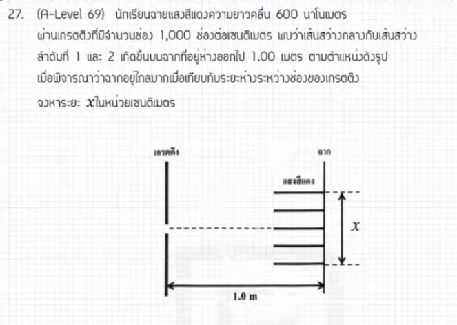

# ข้อ 27: การแทรกสอดผ่านเกรตติง (A-Level ฟิสิกส์ มีนาคม 2569)

จากการตรวจสอบและวิเคราะห์ข้อมูลในแหล่งอ้างอิงของพี่ตั้ว Physics Blueprint พบว่า **ข้อ 27 ของข้อสอบ A-Level ฟิสิกส์ มีนาคม 2569 เป็นเรื่องแสง (การแทรกสอดผ่านเกรตติง) จริงครับ** โดยเป็นการขยับลำดับเนื่องจากข้อสอบส่วนปรนัย (ตัวเลือก) สิ้นสุดที่ข้อ 25 และส่วนอัตนัย (เติมคำตอบ) เริ่มต้นที่ข้อ 26 ดังนั้น **ข้อ 26 คือเรื่องสมดุลกล/แรงเสียดทาน** และ **ข้อ 27 คือเรื่องแสง** ครับ

นี่คือวิธีทำอย่างละเอียดและเนื้อหาสำหรับการศึกษาเพิ่มเติมของโจทย์ข้อ 27 ครับ

## **1. เฉลยวิธีทำโจทย์ข้อ 27 อย่างละเอียด (การแทรกสอดผ่านเกรตติง)**

**โจทย์โดยสรุป:** แสงความยาวคลื่น 600 นาโนเมตร ส่องผ่านเกรตติงที่มีจำนวน 1,000 ช่องต่อเซนติเมตร โดยฉากวางอยู่ห่างออกไป 1 เมตร จงหาระยะห่างระหว่างแถบสว่างลำดับที่ 2 ทั้งสองข้างที่ปรากฏบนฉาก

**ข้อมูลที่โจทย์กำหนด:**

* ความยาวคลื่น ($\lambda$): $600 \times 10^{-9}$ เมตร
* จำนวนช่องเกรตติง: 1,000 ช่อง/cm
* ระยะห่างฉาก ($L$): 1 เมตร
* ลำดับแถบสว่าง ($n$): 2 (แถบสว่างลำดับที่ 2)
* **สิ่งที่โจทย์ถาม:** ระยะห่างระหว่าง $+x_2$ และ $-x_2$ (คือค่า $2x$)

**ขั้นตอนการคำนวณ:**

1. **หาค่าคงที่เกรตติง ($d$):** คือระยะห่างระหว่างช่อง
    * $d = \frac{1 \text{ cm}}{1,000 \text{ ช่อง}} = \frac{10^{-2} \text{ m}}{1,000} = \mathbf{10^{-5}}$ **เมตร**
2. **ใช้สมการการแทรกสอดของเกรตติง:** สำหรับมุมน้อยๆ สามารถใช้สูตร $d \frac{x}{L} = n\lambda$
3. **หาระยะจากแถบสว่างกลางถึงแถบสว่างที่ 2 ($x$):**
    * $10^{-5} \cdot \frac{x}{1} = 2 \cdot (600 \times 10^{-9})$
    * $x = \frac{1200 \times 10^{-9}}{10^{-5}} = 1200 \times 10^{-4}$
    * $x = 0.12$ เมตร หรือ **12 เซนติเมตร**
4. **หาคำตอบสุดท้าย (ระยะระหว่างสองข้าง):**
    * ระยะห่างรวม = $2x = 2 \times 12 = \mathbf{24}$ **เซนติเมตร**

**สรุปคำตอบ:** ต้องเติมคำตอบคือ **24** (หน่วยเซนติเมตร)

---

### **2. เนื้อหาเพื่อศึกษาเพิ่มเติม**

* **เกรตติง (Diffraction Grating):** เป็นอุปกรณ์ที่มีรอยขีดขนานกันจำนวนมาก ทำหน้าที่แยกแสงออกเป็นสเปกตรัม ยิ่งจำนวนช่องต่อเซนติเมตรมาก แถบสว่างจะยิ่งอยู่ห่างกันและมีความคมชัดสูงขึ้น
* **ความแตกต่างจากสลิตคู่:** เกรตติงจะให้แถบสว่างที่แคบและสว่างมากเมื่อเทียบกับสลิตคู่ ทำให้วัดตำแหน่งได้แม่นยำกว่า
* **การประมาณค่ามุม:** ในกรณีที่ระยะฉาก ($L$) มีค่ามากเมื่อเทียบกับระยะเบน ($x$) เราสามารถใช้ $\sin \theta \approx \tan \theta = x/L$ เพื่อความสะดวกในการคำนวณ

---

### **3. กลยุทธ์แก้โจทย์ประเภทนี้**

* **ระวังหน่วย $d$:** นี่คือจุดที่นักเรียนพลาดบ่อยที่สุด ต้องแปลง "ช่องต่อความยาว" ให้เป็น "เมตรต่อช่อง" เสมอ โดยการกลับเศษส่วนและคูณหน่วยให้ถูกต้อง
* **อ่านคำถามให้เคลียร์:** เช็คว่าโจทย์ถาม "ระยะจากแถบกลาง" ($x$) หรือ "ระยะระหว่างแถบสว่างสองข้าง" ($2x$) เหมือนในข้อนี้ที่ถามระยะระหว่างทั้งสองข้าง
* **แปลงนาโนเมตร:** ความยาวคลื่นแสงมักให้มาเป็นนาโนเมตร (nm) อย่าลืมเปลี่ยนเป็น $10^{-9}$ เมตร ก่อนคำนวณเสมอ

---

### **4. ตัวอย่างโจทย์เพิ่มเติมเพื่อฝึกทำ**

**โจทย์:** ใช้แสงความยาวคลื่น 500 nm ส่องผ่านเกรตติงที่มีจำนวน 5,000 ช่องต่อเซนติเมตร ถ้าฉากอยู่ห่างออกไป 2 เมตร แถบสว่างลำดับที่ 1 จะอยู่ห่างจากแถบสว่างกลางกี่เซนติเมตร?

**วิธีคิด:**

1. **หา $d$:** $d = 10^{-2} / 5,000 = 2 \times 10^{-6}$ m
2. **ใช้สูตร:** $x = \frac{n \lambda L}{d}$
3. **แทนค่า:** $x = \frac{1 \times (500 \times 10^{-9}) \times 2}{2 \times 10^{-6}}$
4. **คำนวณ:** $x = \frac{1,000 \times 10^{-9}}{2 \times 10^{-6}} \times 2 = 0.5$ เมตร
5. **คำตอบ:** $0.5$ เมตร = **50 เซนติเมตร**

*(หมายเหตุ: การวิเคราะห์ลำดับข้อและวิธีคำนวณอ้างอิงตามแนวทางการสอนของพี่ตั้ว Physics Blueprint จากแหล่งอ้างอิงที่ได้รับ)*
