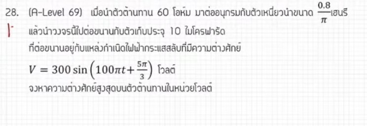

# ข้อ 28 ไฟฟ้ากระแสสลับ (วงจร RLC)

จากการวิเคราะห์ข้อสอบ A-Level ฟิสิกส์ มีนาคม 2569 **ข้อที่ 28** จากแหล่งอ้างอิงของพี่ตั้ว Physics Blueprint พบว่าเป็นเรื่อง **ไฟฟ้ากระแสสลับ (วงจร RLC)** ซึ่งเป็นหนึ่งในข้อที่พี่ตั้วระบุว่า **"เกินหลักสูตร"** ของ สสวท. ชุดปัจจุบัน แต่ถูกนำมาออกในส่วนของอัตนัย (เติมคำตอบ) โดยมีรายละเอียดวิธีทำและเนื้อหาดังนี้ครับ

## **1. เฉลยวิธีทำโจทย์ข้อ 28 อย่างละเอียด**

โจทย์ข้อนี้กำหนดวงจรไฟฟ้ากระแสสลับที่มีตัวต้านทาน ($R$) ต่ออนุกรมกับตัวเหนี่ยวนำ ($L$) และมีตัวเก็บประจุ ($C$) อยู่ในวงจรด้วย แต่ในการคำนวณหาค่าที่โจทย์ต้องการ พี่ตั้ววิเคราะห์ว่าสามารถพิจารณาแยกส่วนได้

**ข้อมูลที่โจทย์กำหนด:**

* **แรงดันไฟฟ้าสูงสุด ($V_{max}$):** 300 โวลต์
* **ความถี่เชิงมุม ($\omega$):** 100$\pi$ เรเดียนต่อวินาที
* **ความต้านทาน ($R$):** 60 โอห์ม
* **ค่าความต้านทานเชิงเหนี่ยวนำ ($X_L$):** คำนวณจาก $\omega L$ ได้เท่ากับ 80 โอห์ม
* **สิ่งที่โจทย์ถาม:** แรงดันไฟฟ้าสูงสุดที่ตกคร่อมตัวต้านทาน ($V_R$)

**ขั้นตอนการคำนวณ:**

1. **หาความต้านทานรวมหรือความต้านทานเชิงซ้อน ($Z$):** สำหรับวงจร $R$ และ $L$ ที่ต่ออนุกรมกัน จะใช้หลักการรวมแบบเวกเตอร์ (พิทาโกรัส)
    * $Z = \sqrt{R^2 + X_L^2}$
    * $Z = \sqrt{60^2 + 80^2} = \sqrt{3600 + 6400} = \sqrt{10000}$
    * $Z = \mathbf{100}$ **โอห์ม**
2. **หากระแสไฟฟ้าสูงสุดในวงจร ($I_{max}$):** เนื่องจากเป็นวงจรอนุกรม กระแสที่ไหลผ่านทุกตัวจะมีค่าเท่ากัน
    * $I = \frac{V_{total}}{Z} = \frac{300}{100} = \mathbf{3}$ **แอมแปร์**
3. **หาแรงดันตกคร่อมตัวต้านทาน ($V_R$):**
    * $V_R = I \times R$
    * $V_R = 3 \times 60 = \mathbf{180}$ **โวลต์**

**สรุปคำตอบ:** แรงดันไฟฟ้าสูงสุดที่ตกคร่อมตัวต้านทานคือ **180 โวลต์**

---

### **2. เนื้อหาเพื่อศึกษาเพิ่มเติม**

* **ความต้านทานเชิงซ้อน (Impedance, $Z$):** ในวงจรไฟฟ้ากระแสสลับ เราไม่สามารถนำค่าโอห์มของ $R, L, C$ มาบวกกันตรงๆ ได้ เพราะเฟสของแรงดันไฟฟ้าไม่ตรงกัน ต้องรวมแบบแผนภาพเฟเซอร์ (Phasor Diagram)
* **ความสัมพันธ์ของเฟส (Phase Relation):**
  * ใน **ตัวต้านทาน ($R$):** แรงดันและกระแสมีเฟสตรงกัน
  * ใน **ตัวเหนี่ยวนำ ($L$):** แรงดันจะมีเฟสนำหน้ากระแสอยู่ 90 องศา ($V$ นำ $I$)
  * ใน **ตัวเก็บประจุ ($C$):** แรงดันจะมีเฟสตามหลังกระแสอยู่ 90 องศา ($I$ นำ $V$)
* **สูตรคำนวณ Reactance:** $X_L = \omega L$ และ $X_C = \frac{1}{\omega C}$

---

### **3. กลยุทธ์แก้โจทย์ประเภทนี้**

* **วาดแผนภาพเฟเซอร์ (Phasor Diagram):** พี่ตั้วแนะนำให้ใช้การรวมแรงดันหรือความต้านทานแบบเวกเตอร์ โดยให้แกน $R$ อยู่ในแนวนอน และ $X_L$ อยู่ในแนวตั้งขึ้น
* **ใช้พิทาโกรัสช่วย:** เมื่อทราบค่า $R$ และ $X_L$ (หรือ $X_C$) มักจะเกิดตัวเลขชุดมาตรฐาน เช่น 3-4-5 หรือ 60-80-100 ซึ่งจะช่วยให้คิดเลขได้รวดเร็วขึ้น
* **วิเคราะห์ว่าเป็นอนุกรมหรือขนาน:** ถ้าเป็นวงจรอนุกรม กระแส ($I$) จะเท่ากันทุกจุด ถ้าเป็นวงจรขนาน แรงดัน ($V$) จะเท่ากันทุกจุด

---

### **4. ตัวอย่างโจทย์เพิ่มเติมเพื่อฝึกทำ**

**โจทย์:** วงจรไฟฟ้ากระแสสลับหนึ่งประกอบด้วยตัวต้านทาน $30 \, \Omega$ ต่ออนุกรมกับตัวเหนี่ยวนำที่มีค่า $X_L = 40 \, \Omega$ ต่อเข้ากับแหล่งจ่ายไฟ $100$ โวลต์ (RMS) จงหาแรงดันไฟฟ้าตกคร่อมตัวต้านทานในหน่วยโวลต์

**วิธีคิด:**

1. **หาค่า $Z$:** $Z = \sqrt{30^2 + 40^2} = 50 \, \Omega$
2. **หากระแส $I$:** $I = \frac{V}{Z} = \frac{100}{50} = 2$ A
3. **หา $V_R$:** $V_R = I \times R = 2 \times 30 = \mathbf{60}$ **โวลต์**

**เฉลย:** แรงดันตกคร่อมตัวต้านทานเท่ากับ **60 โวลต์**

### **หมายเหตุ**

พี่ตั้วระบุว่าข้อสอบเรื่องนี้ "ควรจะฟรี" เนื่องจากเกินหลักสูตร สสวท. ปัจจุบันที่ได้ตัดเนื้อหาการคำนวณเชิงปริมาณของวงจร RLC ออกไปแล้ว

ยินดีครับ! โจทย์ข้อนี้เป็นข้อสอบ A-Level วิชาฟิสิกส์ที่ทดสอบเรื่อง **"วงจรไฟฟ้ากระแสสลับ (AC Circuit)"** ซึ่งมีจุดหลอกตาเล็กน้อยที่ถ้าเรามองขาดจะทำได้รวดเร็วมากครับ มาดูเฉลยวิธีทำอย่างละเอียด เนื้อหาที่เกี่ยวข้อง และกลยุทธ์ในการทำโจทย์ลักษณะนี้กันครับ

---

## เฉลยวิธีทำอย่างละเอียด

### 1. วิเคราะห์สิ่งทีโจทย์กำหนดให้และสิ่งที่โจทย์หลอก

* **ตัวต้านทาน ($R$):** 60 โอห์ม
* **ตัวเหนี่ยวนำ ($L$):** $\frac{0.8}{\pi}$ เฮนรี
* **ตัวเก็บประจุ ($C$):** 10 ไมโครฟารัด (ตัวนี้ต่อขนานอยู่กับชุด $R-L$ และแหล่งกำเนิดไฟฟ้า)
* **สมการความต่างศักย์ของแหล่งกำเนิด:**
$$V = 300 \sin\left(100\pi t + \frac{5\pi}{3}\right)\ \text{โวลต์}$$

> 💡 **กลลวงของโจทย์:** โจทย์ข้อนี้บอกว่าชุด $R-L$ ที่ต่ออนุกรมกัน ไปต่อ **"ขนาน"** กับตัวเก็บประจุ $C$ และแหล่งกำเนิดไฟฟ้า
> ในวงจรขนาน **"ความต่างศักย์ (V) ของทุกสายที่ขนานกันจะเท่ากัน"** ดังนั้น ความต่างศักย์ตกช่อมชุด $R-L$ จะเท่ากับความต่างศักย์ของแหล่งกำเนิดไฟฟ้าพอดี ทำให้เรา**ไม่ต้องนำค่าของตัวเก็บประจุ ($C$) มาคิดเลยครับ** (โจทย์ให้มาหลอกให้เราเสียเวลาคิด Impedance รวมทั้งวงจร)

### 2. หาค่าความถี่เชิงมุม ($\omega$) และความต่างศักย์สูงสุด ($V_{\max}$) จากสมการ

จากรูปทั่วไปของสมการแรงดันไฟฟ้ากระแสสลับ:

$$V = V_{\max} \sin(\omega t + \phi)$$

เมื่อเทียบกับสมการที่โจทย์ให้มา จะได้:

* ความต่างศักย์สูงสุดของแหล่งกำเนิด ($V_{\max}$) = 300 โวลต์
* ความถี่เชิงมุม ($\omega$) = $100\pi\ \text{rad/s}$

### 3. คำนวณหาความต้านทานเชิงเหนี่ยวนำ ($X_L$) ของตัวเหนี่ยวนำ

ใช้สูตร:

$$X_L = \omega L$$

$$X_L = (100\pi) \times \left(\frac{0.8}{\pi}\right) = 80\ \Omega$$

### 4. คำนวณหาความต้านทานเชิงซ้อน ($Z_{RL}$) ของสายที่ $R$ และ $L$ ต่ออนุกรมกัน

เนื่องจาก $R$ และ $L$ ต่ออนุกรมกัน เฟสของแรงดันไฟฟ้าจะทำมุมตั้งฉากกัน เราจึงหาความต้านทานรวมแบบเวกเตอร์ (แผนภาพเฟเซอร์):

$$Z_{RL} = \sqrt{R^2 + X_L^2}$$

$$Z_{RL} = \sqrt{60^2 + 80^2} = \sqrt{3600 + 6400} = \sqrt{10000} = 100\ \Omega$$

### 5. หาขีดจำกัดกระแสไฟฟ้าสูงสุด ($I_{\max}$) ที่ไหลผ่านสาย $R-L$

$$I_{\max} = \frac{V_{\max}}{Z_{RL}} = \frac{300}{100} = 3\ \text{แอมแปร์}$$

### 6. หาความต่างศักย์สูงสุดบนตัวต้านทาน ($V_{R,\max}$)

เนื่องจากในสายอนุกรม กระแสไฟฟ้าที่ไหลผ่าน $R$ และ $L$ จะมีค่าเท่ากัน:

$$V_{R,\max} = I_{\max} \times R$$

$$V_{R,\max} = 3 \times 60 = 180\ \text{โวลต์}$$

**ตอบ:** ความต่างศักย์สูงสุดบนตัวต้านทานเท่ากับ **180 โวลต์**

---

## เนื้อหาเพิ่มเติมเพื่อการศึกษา

ในการทำความเข้าใจวงจรไฟฟ้ากระแสสลับ มี 3 แนวคิดหลักที่ต้องแม่นยำครับ:

1. **ความต้านทานเชิงรวม (Reactance & Impedance):**

* **ตัวเหนี่ยวนำ ($L$):** จะต้านไฟฟ้ากระแสสลับ เรียกว่าความต้านทานเชิงเหนี่ยวนำ ($X_L$) หาจาก $X_L = \omega L$
* **ตัวเก็บประจุ ($C$):** จะมีความต้านทานเชิงความจุ ($X_C$) หาจาก $X_C = \frac{1}{\omega C}$
* **ความต้านทานเชิงซ้อน ($Z$):** คือความต้านทานรวมของระบบที่มีทั้ง $R, L, C$ ผสมกัน

1. **ความสัมพันธ์ทางเฟส (Phase Relationship):**

* ตัวต้านทาน ($R$): กระแสและแรงดันเฟสตรงกัน
* ตัวเหนี่ยวนำ ($L$): แรงดัน ($V_L$) นำหน้ากระแส ($I$) อยู่ 90 องศา
* ตัวเก็บประจุ ($C$): แรงดัน ($V_C$) ตามหลังกระแส ($I$) อยู่ 90 องศา

1. **การรวมแรงดันและ Impedance ในวงจรรวม ($R-L-C$ อนุกรม):**

* $$Z = \sqrt{R^2 + (X_L - X_C)^2}$$

* $$V_{\max} = \sqrt{V_R^2 + (V_L - V_C)^2}$$

---

## กลยุทธ์การแก้โจทย์ไฟฟ้ากระแสสลับ

* **Step 1: แกะสลักสมการคลื่น** เผยพิกัดออกมาให้ได้ก่อนเสมอว่า $V_{\max}$ หรือ $I_{\max}$ คืออะไร และ $\omega$ คืออะไรจากพจน์หน้า $t$
* **Step 2: สแกนโครงสร้างวงจร (อนุกรม หรือ ขนาน)** * ถ้า **อนุกรม** ยึด **"กระแส ($I$) เท่ากัน"** เป็นแกนหลักในการคำนวณ
* ถ้า **ขนาน** ยึด **"แรงดัน ($V$) เท่ากัน"** แหล่งกำเนิดจ่ายไปที่สายไหน สายนั้นได้ $V$ เต็มๆ ไม่ต้องเอาสายอื่นมาปนให้ปวดหัว

* **Step 3: ระวังตัวลวง** ข้อสอบชอบให้ส่วนประกอบเกินมาในสายขนานที่ไม่ได้ถามถึง เพื่อเช็กว่าผู้สอบเข้าใจสมบัติของวงจรขนานจริงหรือไม่

---

## ตัวอย่างโจทย์เพิ่มเติมเพื่อฝึกทำ

### โจทย์ข้อที่ 1

วงจรอนุกรมประกอบด้วยตัวต้านทานขนาด 30 โอห์ม และตัวเก็บประจุที่มีความต้านทานเชิงความจุ ($X_C$) ขนาด 40 โอห์ม ต่อเข้ากับแหล่งกำเนิดไฟฟ้ากระแสสลับที่มีความต่างศักย์สูงสุด 250 โวลต์ จงหาความต่างศักย์สูงสุดที่ตกคร่อมตัวเก็บประจุ

#### เฉลยโจทย์ข้อที่ 1

1. **หาความต้านทานเชิงซ้อนรวม ($Z$):**

$$Z = \sqrt{R^2 + X_C^2} = \sqrt{30^2 + 40^2} = 50\ \Omega$$

1. **หากระแสไฟฟ้าสูงสุด ($I_{\max}$):**

$$I_{\max} = \frac{V_{\max}}{Z} = \frac{250}{50} = 5\ \text{A}$$

1. **หาความต่างศักย์สูงสุดที่ตัวเก็บประจุ ($V_{C,\max}$):**

$$V_{C,\max} = I_{\max} \times X_C = 5 \times 40 = 200\ \text{โวลต์}$$

**ตอบ:** 200 โวลต์

### โจทย์ข้อที่ 2

แหล่งกำเนิดไฟฟ้ากระแสสลับจ่ายแรงดัน $V = 100 \sin(200t)$ โวลต์ ต่อคร่อมวงจรขนานสองสาย สายแรกมีตัวต้านทาน 40 โอห์ม สายที่สองมีตัวเหนี่ยวนำที่มีความเหนี่ยวนำ $L = 0.15$ เฮนรี จงหากระแสไฟฟ้าสูงสุดรวมที่ไหลออกจากแหล่งกำเนิด

#### เฉลยโจทย์ข้อที่ 2

1. **จากสมการ:** $V_{\max} = 100\ \text{V}$ และ $\omega = 200\ \text{rad/s}$
2. **คิดแยกสายเนื่องจากเป็นวงจรขนาน:**

* **สายที่ 1 (ตัวต้านทาน):** กระแสสูงสุด $I_{R,\max} = \frac{V_{\max}}{R} = \frac{100}{40} = 2.5\ \text{A}$
* **สายที่ 2 (ตัวเหนี่ยวนำ):** หา $X_L = \omega L = 200 \times 0.15 = 30\ \Omega$
กระแสสูงสุด $I_{L,\max} = \frac{V_{\max}}{X_L} = \frac{100}{30} = \frac{10}{3}\ \text{A} \approx 3.33\ \text{A}$

1. **รวมกระแสไฟฟ้าแบบเฟเซอร์:** เนื่องจากเฟสของกระแสไฟฟ้าใน $R$ และ $L$ ตั้งฉากกัน ($I_R$ นำหน้า $I_L$ อยู่ 90 องศา)

$$I_{\text{total},\max} = \sqrt{I_R^2 + I_L^2} = \sqrt{2.5^2 + \left(\frac{10}{3}\right)^2} = \sqrt{6.25 + 11.11} = \sqrt{17.36} \approx 4.17\ \text{A}$$

**ตอบ:** ประมาณ 4.17 แอมแปร์
