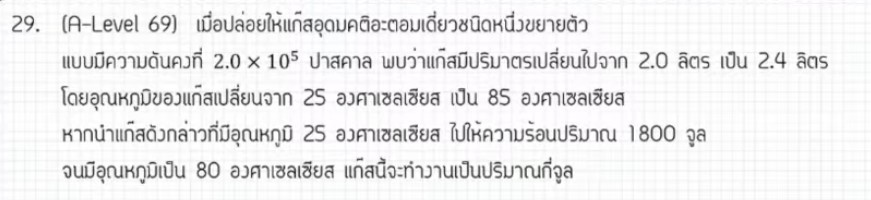

# ฟิสิกส์ A-Level: แก๊สและอุณหพลศาสตร์

ข้อนี้เป็นข้อสอบ A-Level ฟิสิกส์เรื่อง **"แก๊สและทฤษฎีจลน์ + อุณหพลศาสตร์ (Thermodynamics)"** ครับ จุดเด่นของโจทย์ข้อนี้คือการเชื่อมโยงสองสถานการณ์เข้าด้วยกันโดยมีตัวแปรสะพานเชื่อมคือ "จำนวนโมลและค่าคงตัวของแก๊ส ($nR$)" มาดูวิธีคิดแบบเป็นขั้นตอนกันเลยครับ

---

## เฉลยวิธีทำอย่างละเอียด

### 1. วิเคราะห์สถานการณ์ที่ 1 เพื่อหาค่า $nR$

โจทย์บอกว่า แก๊สขยายตัวแบบ **ความดันคงที่ (Isobaric Process)**

* ความดัน ($P$) = $2.0 \times 10^5\ \text{Pa}$
* ปริมาตรเปลี่ยนไป ($\Delta V$) = $2.4 - 2.0 = 0.4\ \text{ลิตร}$
แปลงหน่วยเป็นลูกบาศก์เมตร ($\text{m}^3$):

$$\Delta V = 0.4 \times 10^{-3}\ \text{m}^3$$

* อุณหภูมิเปลี่ยนไป ($\Delta T_1$) = $85^\circ\text{C} - 25^\circ\text{C} = 60^\circ\text{C}$ (หรือ $60\ \text{K}$)

> 💡 **ข้อควรจำ:** ในเรื่องผลต่างของอุณหภูมิ ($\Delta T$) ช่วงสเกลขององศาเซลเซียสและเคลวินจะห่างเท่ากันพอดี ดังนั้น $\Delta T = 60^\circ\text{C}$ จึงเท่ากับ $60\ \text{K}$ ได้เลยโดยไม่ต้องบวก 273 ครับ

จากกฎของแก๊สอุดมคติในกระบวนการความดันคงที่:

$$P\Delta V = nR\Delta T_1$$

แทนค่าเพื่อหาค่าคงที่ชุด $nR$:

$$(2.0 \times 10^5) \times (0.4 \times 10^{-3}) = nR \times 60$$

$$80 = nR \times 60$$

$$nR = \frac{80}{60} = \frac{4}{3}\ \text{J/K}$$

### 2. วิเคราะห์สถานการณ์ที่ 2 เพื่อหางานที่แก๊สทำ ($W$)

โจทย์นำแก๊ส "จำนวนเท่าเดิม" นี้มาให้ความร้อนในเงื่อนไขใหม่

* ความร้อนที่ได้รับ ($Q$) = $+1800\ \text{J}$ (เครื่องหมายเป็นบวกเพราะแก๊สได้รับความร้อน)
* อุณหภูมิเปลี่ยนไป ($\Delta T_2$) = $80^\circ\text{C} - 25^\circ\text{C} = 55\ \text{K}$

หา **พลังงานภายในที่เปลี่ยนไป ($\Delta U$)** ของแก๊สอะตอมเดี่ยว (Monatomic Gas):

$$\Delta U = \frac{3}{2}nR\Delta T_2$$

แทนค่า $nR = \frac{4}{3}$ ที่เราหาไว้จากตอนแรกลงไป:

$$\Delta U = \frac{3}{2} \times \left(\frac{4}{3}\right) \times 55$$

$$\Delta U = 2 \times 55 = 110\ \text{J}$$

ใช้ **กฎข้อที่หนึ่งของอุณหพลศาสตร์ (First Law of Thermodynamics)** เพื่อหางาน ($W$):

$$Q = \Delta U + W$$

$$1800 = 110 + W$$

$$W = 1800 - 110 = 1690\ \text{J}$$

**ตอบ:** แก๊สนี้จะทำงานเป็นปริมาณ **1,690 จูล**

---

## เนื้อหาเพิ่มเติมเพื่อการศึกษา

1. **กฎข้อที่หนึ่งของอุณหพลศาสตร์ ($Q = \Delta U + W$):**

* $Q$ คือ ความร้อน (ถ้าเข้าระบบเป็น $+$, ออกจากระบบเป็น $-$)
* $\Delta U$ คือ พลังงานภายในที่เปลี่ยนไป (ถ้าอุณหภูมิเพิ่มเป็น $+$, อุณหภูมลดเป็น $-$)
* $W$ คือ งานที่ทำโดยแก๊ส (ถ้าแก๊สขยายตัวปริมาตรเพิ่มงานเป็น $+$, แก๊สหดตัวปริมาตรลดงานเป็น $-$)

1. **ประเภทของแก๊สอุดมคติ:**

* **แก๊สอะตอมเดี่ยว (เช่น He, Ne, Ar):** พลังงานภายในหาจาก $U = \frac{3}{2}nRT$ หรือ $\Delta U = \frac{3}{2}nR\Delta T$
* **แก๊สอะตอมคู่ (เช่น $O_2$, $N_2$):** พลังงานภายในหาจาก $U = \frac{5}{2}nRT$ หรือ $\Delta U = \frac{5}{2}nR\Delta T$ (โจทย์มักจะเน้นที่อะตอมเดี่ยวเป็นหลัก)

---

## กลยุทธ์แก้โจทย์ประเภทนี้

* **มองหาตัวเชื่อม (Bridge Variable):** ข้อสอบชอบให้สถานการณ์มา 2 ตอน โดยที่ "จำนวนโมล ($n$)" หรือกลุ่มก้อน "$nR$" ของแก๊สในถังเดิมจะมีค่าคงที่เสมอตลอดทั้งสองตอน ให้รีบหาค่านั้นออกมาก่อน
* **ระวังเรื่องหน่วยปริมาตร:** โจทย์ชอบให้หน่วย "ลิตร" มา ต้องแปลงเป็น $\text{m}^3$ เสมอโดยการคูณ $10^{-3}$ ก่อนนำไปคำนวณร่วมกับปาสคาล ($\text{Pa}$)
* **เครื่องหมายในกฎอุณหพลศาสตร์:** ท่องไว้เสมอว่า "ความร้อนเข้าเป็นบวก แก๊สขยายตัวงานเป็นบวก อุณหภูมิเพิ่มพลังงานภายในเป็นบวก"

---

## ตัวอย่างโจทย์เพิ่มเติมเพื่อฝึกทำ

### โจทย์ข้อที่ 1

แก๊สอุดมคติอะตอมเดี่ยวจำนวนหนึ่งบรรจุในกระบอกสูบ เมื่อทำให้ความดันคงที่และอุณหภูมิเพิ่มขึ้น 50 เคลวิน พบว่าแก๊สขยายตัวและทำงานได้ 200 จูล หากเปลี่ยนสถานการณ์โดยนำแก๊สจำนวนเท่าเดิมนี้ไปใส่ในภาชนะปิดคงรูป (ปริมาตรคงที่) แล้วให้ความร้อนเข้าไป 900 จูล อุณหภูมิของแก๊สจะเพิ่มขึ้นกี่เคลวิน

#### เฉลยโจทย์ข้อที่ 1

1. **ตอนแรก (ความดันคงที่):** งานจากการขยายตัว $W = P\Delta V = nR\Delta T$

$$200 = nR \times 50 \implies nR = 4\ \text{J/K}$$

1. **ตอนที่สอง (ปริมาตรคงที่):** เมื่อปริมาตรคงที่ จะไม่มีการขยายตัว ส่งผลให้งาน $W = 0$
จากกฎข้อที่ 1: $Q = \Delta U + W \implies 900 = \Delta U + 0 \implies \Delta U = 900\ \text{J}$
2. **หาอุณหภูมิที่เปลี่ยนไป ($\Delta T$):**

$$\Delta U = \frac{3}{2}nR\Delta T$$

$$900 = \frac{3}{2} \times 4 \times \Delta T$$

$$900 = 6 \times \Delta T \implies \Delta T = 150\ \text{K}$$

**ตอบ:** อุณหภูมิจะเพิ่มขึ้น 150 เคลวิน

### โจทย์ข้อที่ 2

แก๊สอุดมคติอะตอมเดี่ยวชนิดหนึ่งมีค่า $nR = 2\ \text{J/K}$ เริ่มต้นที่อุณหภูมิ 30 องศาเซลเซียส เมื่อได้รับความร้อนจำนวนหนึ่ง แก๊สขยายตัวแบบความดันคงที่จนอุณหภูมิเปลี่ยนเป็น 70 องศาเซลเซียส จงหาปริมาณความร้อนที่แก๊สนี้ได้รับในหน่วยจูล

#### เฉลยโจทย์ข้อที่ 2

1. หาผลต่างอุณหภูมิ: $\Delta T = 70 - 30 = 40\ \text{K}$
2. หาพลังงานภายในที่เปลี่ยนไป: $\Delta U = \frac{3}{2}nR\Delta T = \frac{3}{2} \times 2 \times 40 = 120\ \text{J}$
3. หางานเนื่องจากความดันคงที่: $W = nR\Delta T = 2 \times 40 = 80\ \text{J}$
4. หาความร้อนรวมจากกฎข้อที่ 1: $Q = \Delta U + W = 120 + 80 = 200\ \text{J}$
**ตอบ:** แก๊สได้รับความร้อน 200 จูล
