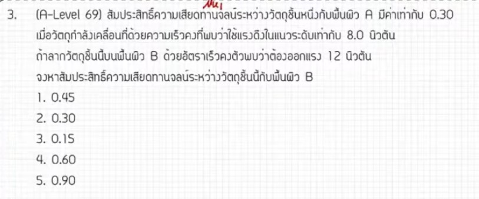

จากการวิเคราะห์ข้อสอบ A-Level ฟิสิกส์ มีนาคม 2569 ข้อที่ 3 จากแหล่งอ้างอิง มีรายละเอียดวิธีทำและเนื้อหาที่น่าสนใจดังนี้ครับ

### **1. เฉลยวิธีทำโจทย์ข้อ 3 อย่างละเอียด**
โจทย์ข้อนี้เป็นเรื่อง **แรงและกฎการเคลื่อนที่ (แรงเสียดทาน)** โดยสถานการณ์คือการลากมวลก้อนเดิมบนพื้นผิวที่ต่างกันด้วยความเร็วคงที่

**ข้อมูลที่โจทย์กำหนด:**
*   **สภาวะที่ 1:** ใช้แรง $F_1 = 8$ นิวตัน, สัมประสิทธิ์ความเสียดทานจลน์ $\mu_{k1} = 0.3$ โดยเคลื่อนที่ด้วยความเร็วคงที่ ($a = 0$)
*   **สภาวะที่ 2:** ใช้แรง $F_2 = 12$ นิวตัน, ต้องการให้เคลื่อนที่ด้วยความเร็วคงที่ ($a = 0$) เช่นกันบนพื้นผิวใหม่
*   **เงื่อนไขสำคัญ:** ใช้วัตถุมวล ($m$) ก้อนเดิม

**ขั้นตอนการคำนวณ:**
1.  **ตั้งสมการสมดุล:** เมื่อวัตถุเคลื่อนที่ด้วยความเร็วคงที่ แรงดึง ($F$) จะต้องเท่ากับแรงเสียดทานจลน์ ($f_k$) เสมอ ตามกฎข้อที่ 1 ของนิวตัน ($\sum F = 0$)
    *   จะได้สมการ: $F = f_k = \mu_k mg$
2.  **ใช้ความสัมพันธ์แบบแปรผัน:** เนื่องจากมวล ($m$) และค่าความเร่งโน้มถ่วง ($g$) มีค่าคงเดิม ดังนั้นแรงดึงจะแปรผันตรงกับสัมประสิทธิ์ความเสียดทาน ($F \propto \mu_k$)
3.  **สร้างสมการอัตราส่วน:**
    *   $\frac{\mu_{k2}}{\mu_{k1}} = \frac{F_2}{F_1}$
    *   $\frac{\mu_{k2}}{0.3} = \frac{12}{8}$
4.  **หาคำตอบ:**
    *   $\frac{12}{8} = 1.5$
    *   $\mu_{k2} = 1.5 \times 0.3 = \mathbf{0.45}$

---

### **2. เนื้อหาเพื่อศึกษาเพิ่มเติม**
*   **กฎข้อที่ 1 ของนิวตัน:** วัตถุจะรักษาความเร็วคงที่ (รวมถึงหยุดนิ่ง) เมื่อแรงลัพธ์ที่กระทำต่อวัตถุเป็นศูนย์
*   **แรงเสียดทานจลน์ ($f_k$):** คือแรงต้านการเคลื่อนที่ที่เกิดขึ้นขณะวัตถุกำลังไถลไปบนพื้นผิว มีค่าเท่ากับ $\mu_k N$ โดย $N$ คือแรงปฏิกิริยาในแนวฉาก
*   **สัมประสิทธิ์ความเสียดทาน ($\mu$):** เป็นค่าที่บอกถึง "ความฝืด" ระหว่างผิวสัมผัส ขึ้นอยู่กับชนิดของวัสดุที่นำมาสัมผัสกันเท่านั้น ไม่ขึ้นกับขนาดของพื้นที่ผิวสัมผัส

---

### **3. กลยุทธ์แก้โจทย์ประเภทนี้**
*   **สังเกตคำว่า "ความเร็วคงที่":** เมื่อเจอคำนี้ในโจทย์กลศาสตร์ ให้ตั้งสมการแรงซ้าย = แรงขวา (หรือ $\sum F = 0$) ทันที
*   **มองหาตัวแปรที่คงที่:** ในโจทย์ข้อนี้คือมวล ($m$) การรู้ว่าอะไรคงที่ช่วยให้เราใช้ "วิธีเปรียบเทียบหรือแปรผัน" ซึ่งทำให้แก้โจทย์ได้เร็วมาก (เพียง 3 บรรทัดก็จบ)
*   **จัดรูปตัวแปรก่อนแทนค่า:** การใช้เศษส่วนหรืออัตราส่วน ($\frac{F_2}{F_1}$) จะช่วยตัดทอนตัวเลขได้ง่ายกว่าการคำนวณหาค่า $m$ ออกมาจริงๆ

---

### **4. ตัวอย่างโจทย์เพิ่มเติมเพื่อฝึกทำ**

**โจทย์:** กล่องมวล $20$ kg ถูกลากไปบนพื้นด้วยแรง $100$ N ทำให้เคลื่อนที่ด้วยความเร็วคงที่ ถ้าเปลี่ยนไปลากบนพื้นอีกชนิดหนึ่งที่ฝืดกว่าเดิม $2$ เท่า (สัมประสิทธิ์ความเสียดทานเพิ่มเป็น $2$ เท่า) จะต้องใช้แรงดึงกี่นิวตันเพื่อให้กล่องยังคงเคลื่อนที่ด้วยความเร็วคงที่?

**วิธีคิด:**
1.  **วิเคราะห์:** จากความสัมพันธ์ $F \propto \mu_k$ (เมื่อ $m, g$ คงที่)
2.  **ตั้งสมการ:** $\frac{F_2}{F_1} = \frac{\mu_{k2}}{\mu_{k1}}$
3.  **แทนค่า:** เนื่องจาก $\mu_{k2} = 2\mu_{k1}$ จะได้อัตราส่วนเป็น $2$
4.  **คำนวณ:** $F_2 = 2 \times F_1 = 2 \times 100 = \mathbf{200}$ **นิวตัน**

*(หมายเหตุ: วิธีการคำนวณและหลักการคิดอ้างอิงตามเนื้อหาที่ปรากฏในแหล่งอ้างอิงของ พี่ตั้ว Physics Blueprint)*