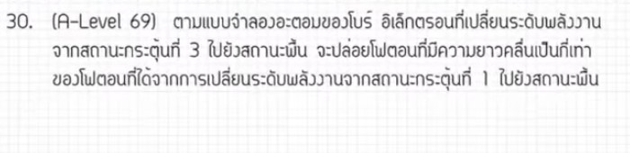

# A-Level ฟิสิกส์ - แบบจำลองอะตอมของโบร์

ข้อนี้เป็นข้อสอบ A-Level ฟิสิกส์ในส่วนของ **"ฟิสิกส์อะตอม (Atomic Physics)"** เรื่องแบบจำลองอะตอมของโบร์ครับ จุดวัดใจของโจทย์ข้อนี้ไม่ได้อยู่ที่คณิตศาสตร์ที่ซับซ้อน แต่คัดเลือกคนจาก **"คำศัพท์"** ที่ถ้าใครจำสับสนจะโดนสับขาหลอกทันทีครับ มาดูวิธีทำและกลยุทธ์กันเลย!

---

## เฉลยวิธีทำอย่างละเอียด

### 1. แกะรหัสคำศัพท์ (จุดตายของข้อนี้)

ในแบบจำลองอะตอมของโบร์ ระดับพลังงานจะแทนด้วยตัวเลข $n$ โดยมีชื่อเรียกเฉพาะดังนี้ครับ:

* **สถานะพื้น (Ground State):** คือระดับพลังงานต่ำสุด $n = 1$
* **สถานะกระตุ้นที่ 1 (1st Excited State):** คือระดับพลังงาน $n = 2$
* **สถานะกระตุ้นที่ 2 (2nd Excited State):** คือระดับพลังงาน $n = 3$
* **สถานะกระตุ้นที่ 3 (3rd Excited State):** คือระดับพลังงาน $n = 4$

> ⚠️ **สรุปง่ายๆ:** เลขระดับพลังงาน ($n$) จะเท่ากับ **เลขสถานะกระตุ้น + 1** เสมอครับ

ดังนั้น โจทย์กำลังเปรียบเทียบการเปลี่ยนระดับพลังงาน 2 กรณี:

* **กรณีที่ 1:** จากสถานะกระตุ้นที่ 3 ($n = 4$) $\rightarrow$ สถานะพื้น ($n = 1$) ให้ความยาวคลื่นมาเป็น $\lambda_1$
* **กรณีที่ 2:** จากสถานะกระตุ้นที่ 1 ($n = 2$) $\rightarrow$ สถานะพื้น ($n = 1$) ให้ความยาวคลื่นมาเป็น $\lambda_2$
* โจทย์ถามว่า $\lambda_1$ เป็นกี่เท่าของ $\lambda_2$ (หาค่าของ $\frac{\lambda_1}{\lambda_2}$)

### 2. ตั้งสมการความสัมพันธ์

พลังงานของอิเล็กตรอนที่ระดับพลังงาน $n$ ใดๆ แแปรผันตามสูตร $E_n = -\frac{\text{ค่าคงที่}}{n^2}$
เมื่ออิเล็กตรอนคายพลังงานออกมาในรูปของโฟตอน พลังงานของโฟตอน ($\Delta E$) หาได้จาก:

$$\Delta E = E_{\text{high}} - E_{\text{low}} = \text{ค่าคงที่} \times \left( \frac{1}{n_{\text{low}}^2} - \frac{1}{n_{\text{high}}^2} \right)$$

และจากความสัมพันธ์ของแสง พลังงานโฟตอนแปรผกผันกับความยาวคลื่น: $\Delta E = \frac{hc}{\lambda}$ ดังนั้น $\lambda \propto \frac{1}{\Delta E}$

### 3. คำนวณค่าพลังงานของทั้งสองกรณี (คิดเฉพาะสัดส่วนเศษส่วน)

* **กรณีที่ 1 ($n = 4 \rightarrow n = 1$):**

$$\Delta E_1 \propto \left( \frac{1}{1^2} - \frac{1}{4^2} \right) = 1 - \frac{1}{16} = \frac{15}{16}$$

* **กรณีที่ 2 ($n = 2 \rightarrow n = 1$):**

$$\Delta E_2 \propto \left( \frac{1}{1^2} - \frac{1}{2^2} \right) = 1 - \frac{1}{4} = \frac{3}{4}$$

### 4. หาอัตราส่วนความยาวคลื่น

เนื่องจากความยาวคลื่นแปรผกผันกับพลังงาน:

$$\frac{\lambda_1}{\lambda_2} = \frac{\Delta E_2}{\Delta E_1}$$

แทนค่าเศษส่วนที่เราคิดไว้ลงไป:

$$\frac{\lambda_1}{\lambda_2} = \frac{\frac{3}{4}}{\frac{15}{16}} = \frac{3}{4} \times \frac{16}{15}$$

ตัดตัวเลขให้ง่ายขึ้น:

$$\frac{\lambda_1}{\lambda_2} = \frac{1}{1} \times \frac{4}{5} = \frac{4}{5} = 0.8\ \text{เท่า}$$

**ตอบ:** จะปล่อยโฟตอนที่มีความยาวคลื่นเป็น **0.8 เท่า** (หรือ $\frac{4}{5}$ เท่า) ของกรณีหลัง

---

## เนื้อหาเพิ่มเติมเพื่อการศึกษา

ตามทฤษฎีอะตอมของโบร์ (Bohr's Atomic Model) มีสูตรสำเร็จรูปที่ควรรู้ไว้เพื่อช่วยให้คิดเลขเร็วขึ้นในการหาพลังงานระดับต่างๆ ของไฮโดรเจน:

$$E_n = -\frac{13.6}{n^2}\ \text{eV}$$

* $n=1 \implies E_1 = -13.6\ \text{eV}$ (พลังงานต่ำสุด เสถียรที่สุด)
* $n=2 \implies E_2 = -3.4\ \text{eV}$
* $n=3 \implies E_3 = -1.51\ \text{eV}$
* $n=4 \implies E_4 = -0.85\ \text{eV}$

เมื่อเรานำพลังงานมาลบกันเพื่อหาความต่างศักย์หรือพลังงานที่คายออกมา ถ้าเราจำสัดส่วนเศษส่วน $1 - \frac{1}{n^2}$ ได้จะประหยัดเวลาในห้องสอบได้มากครับ

---

## กลยุทธ์แก้โจทย์ประเภทนี้

* **ขีดเส้นใต้คำว่า "สถานะกระตุ้น" ทันที:** พอเจอคำนี้ให้เอานิ้วบวกหนึ่งในใจเพื่อแปลงเป็นค่า $n$ เสมอ อย่าเผลอใช้เลขตรงๆ
* **สร้างความสัมพันธ์แบบอัตราส่วน (Ratio):** โจทย์แนว "เป็นกี่เท่า" ไม่จำเป็นต้องแทนค่าคงที่อย่าง $h$ (ค่าคงตัวของพลังค์) หรือ $c$ (ความเร็วแสง) หรือ $13.6\ \text{eV}$ ลงไปให้เหนื่อย ให้ติดเป็นความแปรผันแล้วจับหารกัน ตัวแปรเหล่านั้นจะตัดกันไปเองหมดครับ
* **จำสมบัติผกผัน:** พลังงานมาก $\rightarrow$ ความถี่ ($f$) สูง $\rightarrow$ ความยาวคลื่น ($\lambda$) สั้น

---

## ตัวอย่างโจทย์เพิ่มเติมเพื่อฝึกทำ

### โจทย์ข้อที่ 1

ตามแบบจำลองอะตอมของโบร์ หากอิเล็กตรอนเปลี่ยนระดับพลังงานจาก **สถานะกระตุ้นที่ 2 ไปยังสถานะพื้น** จะปล่อยโฟตอนที่มี **ความถี่** เป็นกี่เท่าของการเปลี่ยนระดับพลังงานจากสถานะกระตุ้นที่ 1 ไปยังสถานะพื้น

#### เฉลยโจทย์ข้อที่ 1

1. **แปลงสถานะเป็นค่า $n$:**

* สถานะกระตุ้นที่ 2 $\rightarrow$ สถานะพื้น คือ $n = 3 \rightarrow n = 1$
* สถานะกระตุ้นที่ 1 $\rightarrow$ สถานะพื้น คือ $n = 2 \rightarrow n = 1$

1. **ความสัมพันธ์ความถี่:** เนื่องจาก พลังงาน $E = hf$ ดังนั้น ความถี่แปรผันตรงกับพลังงาน ($f \propto \Delta E$)
2. **คิดสัดส่วนพลังงาน:**

* $\Delta E_A \propto 1 - \frac{1}{3^2} = 1 - \frac{1}{9} = \frac{8}{9}$
* $\Delta E_B \propto 1 - \frac{1}{2^2} = 1 - \frac{1}{4} = \frac{3}{4}$

1. **หาอัตราส่วน:**

$$\frac{f_A}{f_B} = \frac{\Delta E_A}{\Delta E_B} = \frac{\frac{8}{9}}{\frac{3}{4}} = \frac{8}{9} \times \frac{4}{3} = \frac{32}{27}\ \text{เท่า}$$

**ตอบ:** $\frac{32}{27}$ เท่า (หรือประมาณ 1.19 เท่า)

### โจทย์ข้อที่ 2

อิเล็กตรอนของไฮโดรเจนคายพลังงานเมื่อเปลี่ยนระดับพลังงานจาก $n = 3$ ไปยัง $n = 2$ ได้โฟตอนมีความยาวคลื่นเป็น $\lambda$ อยากทราบว่าหากอิเล็กตรอนเปลี่ยนระดับพลังงานจาก $n = 4$ ไปยัง $n = 2$ จะปล่อยโฟตอนที่มีความยาวคลื่นเท่าใดในเทอมของ $\lambda$

#### เฉลยโจทย์ข้อที่ 2

1. **กรณีที่ 1 ($n=3 \rightarrow n=2$):**
$$\Delta E_1 \propto \frac{1}{2^2} - \frac{1}{3^2} = \frac{1}{4} - \frac{1}{9} = \frac{5}{36} \implies \lambda_1 = \lambda$$

2. **กรณีที่ 2 ($n=4 \rightarrow n=2$):**
$$\Delta E_2 \propto \frac{1}{2^2} - \frac{1}{4^2} = \frac{1}{4} - \frac{1}{16} = \frac{3}{16} \implies \lambda_2$$

3. **ตั้งสัดส่วนผกผัน:**

$$\frac{\lambda_2}{\lambda} = \frac{\Delta E_1}{\Delta E_2} = \frac{\frac{5}{36}}{\frac{3}{16}} = \frac{5}{36} \times \frac{16}{3} = \frac{5 \times 4}{9 \times 3} = \frac{20}{27}$$

$$\lambda_2 = \frac{20}{27}\lambda$$

**ตอบ:** $\frac{20}{27}\lambda$
