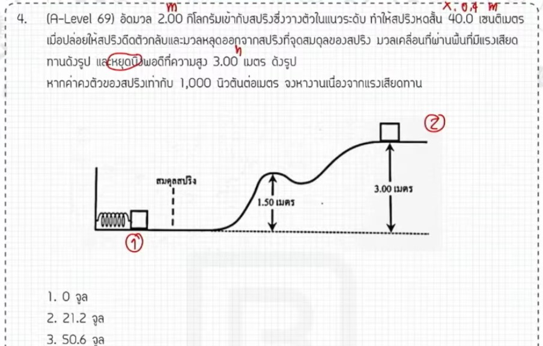

จากการวิเคราะห์ข้อสอบ A-Level ฟิสิกส์ มีนาคม 2569 ข้อที่ 4 จากแหล่งอ้างอิง มีรายละเอียดวิธีทำและเนื้อหาที่น่าสนใจดังนี้ครับ

### **1. เฉลยวิธีทำโจทย์ข้อ 4 อย่างละเอียด**
โจทย์ข้อนี้เป็นเรื่อง **งานและพลังงาน** โดยเป็นสถานการณ์ที่วัตถุถูกดีดด้วยสปริงขึ้นไปบนระนาบเอียงจนหยุดนิ่ง และให้หางานของแรงเสียดทาน (พลังงานที่สูญเสียไป)

**ข้อมูลที่โจทย์กำหนด (วิเคราะห์จากขั้นตอนการคำนวณในแหล่งอ้างอิง):**
*   **มวลวัตถุ ($m$):** 2 กิโลกรัม
*   **ค่าคงตัวสปริง ($k$):** 1,000 นิวตันต่อเมตร
*   **ระยะหดสปริง ($x$):** 40 เซนติเมตร หรือ 0.4 เมตร
*   **ความสูงที่วัตถุขึ้นไปได้ ($h$):** 3 เมตร (จากผลคำนวณ $mgh$)
*   **ค่าความเร่งโน้มถ่วง ($g$):** 9.8 เมตรต่อวินาทีกำลังสอง

**ขั้นตอนการคำนวณ:**
1.  **หาพลังงานที่จุดเริ่มต้น ($E_1$):** ที่จุดแรกพลังงานทั้งหมดคือพลังงานศักย์ยืดหยุ่นในสปริง
    *   $E_1 = \frac{1}{2}kx^2 = \frac{1}{2} \times 1,000 \times (0.4)^2$
    *   $E_1 = 500 \times 0.16 = \mathbf{80}$ **จูล**
2.  **หาพลังงานที่จุดสุดท้าย ($E_2$):** เมื่อวัตถุหยุดนิ่งที่ความสูง $h$ พลังงานทั้งหมดคือพลังงานศักย์โน้มถ่วง
    *   $E_2 = mgh = 2 \times 9.8 \times 3$
    *   $E_2 = 19.6 \times 3 = \mathbf{58.8}$ **จูล**
3.  **หางานของแรงเสียดทาน ($W$):** ผลต่างของพลังงานคือพลังงานที่สูญเสียไปเนื่องจากแรงเสียดทาน
    *   $W = E_1 - E_2 = 80 - 58.8$
    *   $W = \mathbf{21.2}$ **จูล**

**สรุปคำตอบ:** งานของแรงเสียดทานหรือพลังงานที่ลดลงเท่ากับ **21.2 จูล**

---

### **2. เนื้อหาเพื่อศึกษาเพิ่มเติม**
*   **ทฤษฎีบทงาน-พลังงาน:** งานของแรงลัพธ์ที่ไม่ใช่แรงอนุรักษ์ (เช่น แรงเสียดทาน) จะเท่ากับส่วนต่างของพลังงานรวมที่เปลี่ยนไป ($W = \Delta E$)
*   **พลังงานศักย์ยืดหยุ่น ($E_p = \frac{1}{2}kx^2$):** พลังงานที่สะสมในวัตถุที่ยืดหรือหดจากตำแหน่งสมดุล โดย $x$ ต้องใช้หน่วยเมตรเสมอ
*   **การเลือกค่า $g$:** ในข้อสอบ A-Level บางครั้งโจทย์บังคับใช้ $g = 9.8$ ซึ่งทำให้ตัวเลขอาจจะดูคำนวณยากกว่าใช้ $10$ นักเรียนจึงต้องฝึกการคูณเลขทศนิยมให้แม่นยำ

---

### **3. กลยุทธ์แก้โจทย์ประเภทนี้**
*   **มองที่จุดเริ่มและจุดจบ:** ไม่ต้องสนใจรายละเอียดการเคลื่อนที่ระหว่างทาง (เช่น ความชันของทางเอียง) ให้โฟกัสที่พลังงาน ณ จุดเริ่มต้นและจุดสุดท้ายที่โจทย์ถามถึงเท่านั้น
*   **ระวังหน่วย:** โจทย์มักให้ระยะทางมาเป็นเซนติเมตร (cm) ต้องเปลี่ยนเป็นเมตร (m) ก่อนแทนในสูตรพลังงานเสมอ
*   **การจัดการตัวเลข:** หากเจอเลขยกกำลังสอง เช่น $(0.4)^2$ ให้มองเป็น $0.4 \times 0.4$ แล้วค่อยๆ ตัดเลขจะช่วยลดโอกาสผิดพลาดได้มากกว่าการยกกำลังก่อน

---

### **4. ตัวอย่างโจทย์เพิ่มเติมเพื่อฝึกทำ**

**โจทย์:** กล่องมวล 1 กิโลกรัม ถูกกดทับสปริงที่มีค่า $k = 400$ N/m จนหดเข้าไป 20 เซนติเมตร เมื่อปล่อยมือกล่องถูกดีดขึ้นไปตามพื้นเอียงที่มีแรงเสียดทาน จนไปหยุดนิ่งที่ความสูง 0.5 เมตร จงหาว่าพลังงานสูญเสียไปกับแรงเสียดทานกี่จูล (กำหนดให้ $g = 10$ m/s²)

**วิธีคิด:**
1.  **พลังงานเริ่มต้น ($E_1$):** $\frac{1}{2} \times 400 \times (0.2)^2 = 200 \times 0.04 = \mathbf{8}$ **จูล**
2.  **พลังงานสุดท้าย ($E_2$):** $mgh = 1 \times 10 \times 0.5 = \mathbf{5}$ **จูล**
3.  **งานแรงเสียดทาน:** $8 - 5 = \mathbf{3}$ **จูล**

*(หมายเหตุ: วิธีการคำนวณและเทคนิคการมองจุดเริ่ม-จุดจบ อ้างอิงตามแนวทางการสอนของ พี่ตั้ว Physics Blueprint จากแหล่งอ้างอิงที่กำหนด)*