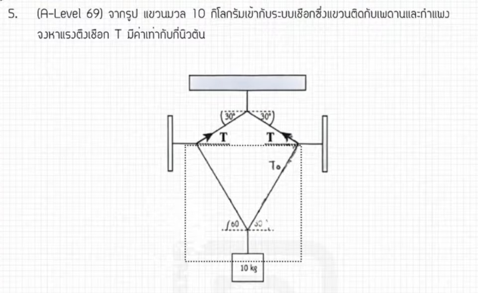

จากการวิเคราะห์ข้อสอบ A-Level ฟิสิกส์ มีนาคม 2569 ข้อที่ 5 จากแหล่งอ้างอิงของพี่ตั้ว Physics Blueprint มีรายละเอียดวิธีทำและเนื้อหาที่ควรศึกษาดังนี้ครับ

### **1. เฉลยวิธีทำโจทย์ข้อ 5 อย่างละเอียด**
โจทย์ข้อนี้เป็นเรื่อง **สมดุลกล (Static Equilibrium)** ของระบบเชือกและมวล โดยมีเทคนิคสำคัญคือการมองภาพรวมของระบบเพื่อให้คำนวณได้รวดเร็วขึ้น

**ข้อมูลจากโจทย์และรูปภาพ:**
*   **มวลรวมของระบบ:** 10 กิโลกรัม
*   **มุมของเชือกที่กระทำ:** 30 องศา กับแนวราบ
*   **ค่าความเร่งโน้มถ่วง ($g$):** 9.8 เมตรต่อวินาทีกำลังสอง

**ขั้นตอนการคำนวณ:**
1.  **การมองเป็นระบบเดียว:** แทนที่จะแยกคิดทีละจุด พี่ตั้วแนะนำให้มองมวลทั้งหมดรวมกันเป็นก้อนเดียวด้านล่าง ซึ่งมีมวลรวม 10 kg
2.  **คำนวณแรงดึงลง (น้ำหนัก $W$):** 
    *   $W = mg = 10 \times 9.8 = \mathbf{98}$ **นิวตัน**
3.  **แตกแรงตึงเชือกในแนวดิ่ง:** เชือกสองเส้นทำมุม 30 องศา เมื่อแตกแรงเข้าสู่แนวดิ่งจะได้แรงขึ้นรวมเป็น $2T \sin 30^\circ$
4.  **ตั้งสมการสมดุล (แรงขึ้น = แรงลง):**
    *   $2T \sin 30^\circ = mg$
    *   $2T \times (1/2) = 98$
    *   จะได้ $T = \mathbf{98}$ **นิวตัน**
    
**สรุปคำตอบ:** แรงตึงเชือกมีค่าเท่ากับ **98 นิวตัน** (ตอบตัวเลือกที่ตรงกับค่านี้)

---

### **2. เนื้อหาเพื่อศึกษาเพิ่มเติม**
*   **แรงตึงเชือก ($T$):** เป็นแรงที่เกิดขึ้นในเส้นเชือกที่ขึงตึง มีทิศพุ่งออกจากวัตถุที่เราสนใจเสมอ
*   **การแตกแรง (Vector Resolution):** การนำแรงที่ทำมุมมาแยกเป็นองค์ประกอบในแนวแกน $X$ และแกน $Y$ โดยใช้ฟังก์ชันตรีโกณมิติ ($\sin, \cos$)
*   **เงื่อนไขสมดุล:** สำหรับวัตถุที่หยุดนิ่ง ผลรวมของแรงในทุกทิศทางต้องเป็นศูนย์ ($\sum F_x = 0, \sum F_y = 0$)

---

### **3. กลยุทธ์แก้โจทย์ประเภทนี้**
*   **การเลือก "ระบบ" ที่สนใจ:** กลยุทธ์ที่สำคัญที่สุดในข้อนี้คือ **"การมองเป็นระบบเดียว"** แทนที่จะใช้ทฤษฎีลามี (Lami's Theorem) คิดแยกทีละจุด ซึ่งจะทำให้เสียเวลาและซับซ้อนกว่ามาก
*   **ตรวจสอบค่า $g$:** ในข้อสอบชุดนี้มีการเน้นใช้ $g = 9.8$ m/s² ซึ่งหากนักเรียนใช้ $10$ m/s² อาจจะได้คำตอบเป็น 100 นิวตัน และอาจมีตัวเลือกหลอกไว้
*   **วาด Free Body Diagram (FBD):** การวาดแรงทั้งหมดที่กระทำต่อวัตถุจะช่วยให้เห็นภาพชัดเจนว่าแรงไหนต้องแตกมุม และแรงไหนสมดุลกัน

---

### **4. ตัวอย่างโจทย์เพิ่มเติมเพื่อฝึกทำ**

**โจทย์:** วัตถุมวล 20 กิโลกรัม ถูกแขวนด้วยเชือกสองเส้นทำมุม 45 องศากับแนวราบทั้งสองด้าน จงหาแรงตึงในเส้นเชือกแต่ละเส้น (กำหนดให้ $g = 10$ m/s²)

**วิธีคิด:**
1.  **หาแรงดึงลง:** $W = mg = 20 \times 10 = 200$ นิวตัน
2.  **แตกแรงขึ้น:** เชือกสองเส้นจะได้ $2T \sin 45^\circ$
3.  **ตั้งสมการ:** $2T \sin 45^\circ = 200$
4.  **คำนวณ:** $2T \times (\sqrt{2}/2) = 200$ จะได้ $T = 200 / \sqrt{2} = \mathbf{100\sqrt{2}}$ **นิวตัน** (หรือประมาณ 141.4 นิวตัน)

*(หมายเหตุ: ขั้นตอนการแก้โจทย์และเทคนิคการมองระบบอ้างอิงตามแนวทางของ พี่ตั้ว และ พี่ต้นสน จากแหล่งอ้างอิงที่กำหนด)*