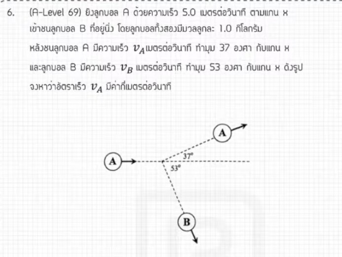

จากการวิเคราะห์ข้อสอบ A-Level ฟิสิกส์ มีนาคม 2569 ข้อที่ 6 จากแหล่งอ้างอิงของพี่ตั้ว Physics Blueprint มีรายละเอียดวิธีทำและเนื้อหาที่น่าสนใจดังนี้ครับ

### **1. เฉลยวิธีทำโจทย์ข้อ 6 อย่างละเอียด**
โจทย์ข้อนี้เป็นเรื่อง **โมเมนตัมและการชนใน 2 มิติ** โดยเป็นสถานการณ์ที่มวล A วิ่งไปชนมวล B ที่หยุดนิ่ง ซึ่งมวลทั้งสองก้อนมีค่าเท่ากัน และเป็นการชนแบบยืดหยุ่น

**ข้อมูลจากโจทย์:**
*   **ความเร็วต้นของมวล A ($u_A$):** 5 เมตรต่อวินาที
*   **มวล:** $m_A = m_B$ (มวลเท่ากัน),
*   **ลักษณะการชน:** การชนแบบยืดหยุ่นใน 2 มิติ โดยหลังชนมวลก้อนหนึ่งทำมุม 37 องศากับแนวเดิม

**ขั้นตอนการคำนวณด้วย "ลัทธิสามเหลี่ยม":**
1.  **ใช้กฎการอนุรักษ์โมเมนตัม:** ผลรวมโมเมนตัมก่อนชนต้องเท่ากับหลังชน ($\vec{P}_{ก่อน} = \vec{P}_{หลัง}$) เนื่องจากมวลเท่ากัน เราสามารถตัดตัวแปรมวลออกและพิจารณาเป็นเวกเตอร์ของความเร็วได้เลย ($\vec{u}_A = \vec{v}_A + \vec{v}_B$),
2.  **เงื่อนไขพิเศษของการชนแบบยืดหยุ่น:** เมื่อวัตถุมีมวลเท่ากันชนกันแบบยืดหยุ่น โดยก้อนหนึ่งหยุดนิ่งอยู่กับที่ **มุมระหว่างเวกเตอร์ความเร็วหลังชนของทั้งสองก้อนจะทำมุมฉาก (90 องศา) ต่อกันเสมอ**
3.  **สร้างรูปสามเหลี่ยมเวกเตอร์:**
    *   ด้านตรงข้ามมุมฉาก (ผลรวม) คือความเร็วต้น $u = 5$ m/s
    *   มุมที่กระทำคือ 37 องศา
    *   จะได้สามเหลี่ยมมุมฉากที่มีอัตราส่วนด้านเป็น **3 : 4 : 5**
4.  **หาค่าความเร็ว:**
    *   ถ้าด้านยาวสุดคือ 5 m/s
    *   ด้านที่ประชิดมุม 37 องศา จะมีความเร็วเป็น **4 เมตรต่อวินาที** ($5 \cos 37^\circ$)
    *   ด้านที่ตรงข้ามมุม 37 องศา จะมีความเร็วเป็น **3 เมตรต่อวินาที** ($5 \sin 37^\circ$)

**สรุปคำตอบ:** ความเร็วของมวลหลังการชนจะมีค่าเป็น 3 m/s และ 4 m/s (ขึ้นอยู่กับว่าโจทย์ถามมวลก้อนไหน),

---

### **2. เนื้อหาเพื่อศึกษาเพิ่มเติม**
*   **การอนุรักษ์โมเมนตัมใน 2 มิติ:** โมเมนตัมเป็นปริมาณเวกเตอร์ ต้องคำนวณทั้งขนาดและทิศทาง โดยสามารถแยกคิดในแกน X และ Y หรือใช้การรวมเวกเตอร์แบบหางต่อหัว
*   **การชนแบบยืดหยุ่น (Elastic Collision):** คือการชนที่พลังงานจลน์รวมของระบบมีค่าคงที่ ไม่มีการสูญเสียพลังงานไปในรูปอื่น
*   **กรณีพิเศษ $m_1 = m_2$:** ในการชนแบบยืดหยุ่นที่มวลเท่ากันและก้อนที่ถูกชนหยุดนิ่ง เวกเตอร์ความเร็วหลังชนจะตั้งฉากกันเสมอ ซึ่งช่วยให้เราแก้โจทย์ได้เร็วขึ้นโดยไม่ต้องแตกแรง

---

### **3. กลยุทธ์แก้โจทย์ประเภทนี้**
*   **ใช้เรขาคณิตเข้าช่วย:** กลยุทธ์ "ลัทธิสามเหลี่ยม" ของพี่ตั้วคือการใช้รูปสามเหลี่ยมเวกเตอร์แทนการตั้งสมการแกน X และ Y ซึ่งจะช่วยประหยัดเวลาได้มากในห้องสอบ
*   **สังเกตมวลและลักษณะการชน:** ถ้าโจทย์บอกว่ามวลเท่ากันและชนแบบยืดหยุ่น ให้มองหา "มุมฉาก" ทันที
*   **จดจำอัตราส่วนสามเหลี่ยมมาตรฐาน:** สามเหลี่ยม 37, 53 องศา (อัตราส่วน 3:4:5) ออกข้อสอบบ่อยมาก หากความเร็วต้นเป็น 5 หรือพหุคูณของ 5 คำตอบมักจะหนีไม่พ้นเลข 3 และ 4

---

### **4. ตัวอย่างโจทย์เพิ่มเติมเพื่อฝึกทำ**

**โจทย์:** ลูกบิลเลียด A วิ่งด้วยความเร็ว 10 m/s เข้าชนลูกบิลเลียด B ที่หยุดนิ่ง ถ้าลูกบิลเลียดทั้งสองมีมวลเท่ากันและการชนเป็นแบบยืดหยุ่น หลังการชนลูกบิลเลียด A เบนไปทำมุม 53 องศากับแนวเดิม จงหาความเร็วของลูกบิลเลียด B หลังชน

**วิธีคิด:**
1.  **วิเคราะห์:** มวลเท่ากัน + ชนยืดหยุ่น + ก้อน B หยุดนิ่ง $\rightarrow$ ความเร็วหลังชนตั้งฉากกัน
2.  **สร้างสามเหลี่ยม:** ด้านตรงข้ามมุมฉาก ($u$) = 10 m/s
3.  **หาความเร็ว B ($v_B$):** เนื่องจาก A ทำมุม 53 องศา เวกเตอร์ของ B จะต้องเป็นด้านที่ทำมุม 37 องศากับแนวเดิม (เพื่อให้รวมกันได้ 90 องศา) หรือเป็นด้านตรงข้ามมุม 53 องศา
4.  **คำนวณ:** $v_B = u \sin 53^\circ = 10 \times (4/5) = \mathbf{8}$ **เมตรต่อวินาที**

*(หมายเหตุ: การเฉลยนี้อ้างอิงหลักการ "ลัทธิสามเหลี่ยม" และการวิเคราะห์เวกเตอร์จากแหล่งอ้างอิงของพี่ตั้ว Physics Blueprint)*,