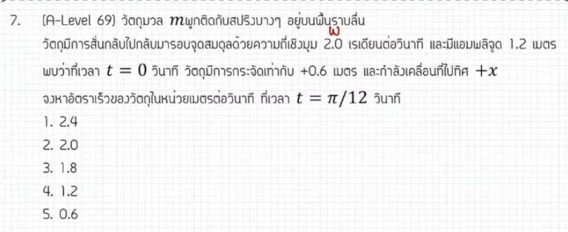

จากการวิเคราะห์ข้อสอบ A-Level ฟิสิกส์ มีนาคม 2569 ข้อที่ 7 จากแหล่งอ้างอิงของพี่ตั้ว Physics Blueprint มีรายละเอียดวิธีทำและเนื้อหาที่ควรศึกษาดังนี้ครับ

### **1. เฉลยวิธีทำโจทย์ข้อ 7 อย่างละเอียด**
โจทย์ข้อนี้เป็นเรื่อง **การเคลื่อนที่แบบซิมเปิลฮาร์มอนิก (Simple Harmonic Motion - SHM)** ที่ต้องใช้สมการตรีโกณมิติแบบเต็มรูปแบบในการแก้ปัญหา

**ข้อมูลที่โจทย์กำหนด:**
*   **แอมพลิจูด ($A$):** 1.2 เมตร
*   **ความถี่เชิงมุม ($\omega$):** 2 เรเดียนต่อวินาที
*   **เงื่อนไขเริ่มต้น ($t = 0$):** การกระจัด $x = 0.6$ เมตร และกำลังเคลื่อนที่ไปในทิศบวก ($+x$)
*   **คำถาม:** หาความเร็ว ($v$) ณ เวลา $t = \pi/12$ วินาที

**ขั้นตอนการคำนวณ:**
1.  **หาค่าเฟสเริ่มต้น ($\phi$):** จากสมการการกระจัด $x = A \sin(\omega t + \phi)$
    *   ที่ $t = 0$: $0.6 = 1.2 \sin(0 + \phi)$
    *   จะได้ $\sin \phi = 0.5$ ดังนั้น $\phi$ เป็นไปได้สองค่าคือ $30^\circ (\pi/6)$ หรือ $150^\circ (5\pi/6)$
2.  **ตรวจสอบทิศทางเพื่อเลือกค่า $\phi$:** โจทย์ระบุว่าที่ $t=0$ วัตถุเคลื่อนที่ไปทาง $+x$ (ความเร็วเป็นบวก)
    *   จากสมการความเร็ว $v = \omega A \cos(\omega t + \phi)$ ที่ $t=0$ จะได้ $v = \omega A \cos \phi$
    *   ถ้าใช้ $30^\circ$: ค่า $\cos 30^\circ$ เป็นบวก ($>0$) ตรงตามเงื่อนไข
    *   ถ้าใช้ $150^\circ$: ค่า $\cos 150^\circ$ เป็นลบ ($<0$) ใช้ไม่ได้ ดังนั้นเฟสเริ่มต้นคือ **$\pi/6$**
3.  **หาความเร็วที่เวลา $t = \pi/12$:**
    *   $v = (2)(1.2) \cos(2(\pi/12) + \pi/6)$
    *   $v = 2.4 \cos(\pi/6 + \pi/6) = 2.4 \cos(\pi/3)$ หรือ $2.4 \cos 60^\circ$
    *   $v = 2.4 \times (1/2) = \mathbf{1.2}$ **เมตรต่อวินาที**

**สรุปคำตอบ:** ความเร็วของวัตถุมีค่าเท่ากับ **1.2 เมตรต่อวินาที**

---

### **2. เนื้อหาเพื่อศึกษาเพิ่มเติม**
*   **สมการการเคลื่อนที่ SHM:** ต้องแม่นยำทั้งสมการการกระจัด ($x$), ความเร็ว ($v$), และความเร่ง ($a$) ในรูปฟังก์ชันไซน์และคอส
*   **เฟส (Phase) และเฟสเริ่มต้น:** คือมุมที่ใช้บอกตำแหน่งของวัตถุ ณ เวลาต่างๆ โดยเฟสเริ่มต้น ($\phi$) จะบอกตำแหน่ง ณ วินาทีที่ศูนย์
*   **วงกลมหนึ่งหน่วย (Reference Circle):** การมองภาพ SHM เป็นการเงาของการเคลื่อนที่แบบวงกลมช่วยให้เข้าใจที่มาของมุมเฟสได้ชัดเจนขึ้น

---

### **3. กลยุทธ์แก้โจทย์ประเภทนี้**
*   **อย่าลืมตรวจสอบค่า $\phi$:** หลายคนหาค่า $\sin \phi$ ได้แล้วเลือกมุมแรกทันที แต่ในข้อสอบระดับสูงมักจะหลอกเรื่องทิศทาง (บวก/ลบ) จึงต้องเช็คค่า $\cos \phi$ ควบคู่ไปด้วยเสมอ
*   **ใช้หน่วยเรเดียน (Radian):** ในฟิสิกส์ เมื่อมีตัวแปร $t$ อยู่ในฟังก์ชันตรีโกณมิติ มุมที่คำนวณได้จาก $\omega t$ จะเป็นเรเดียนเสมอ
*   **วิเคราะห์กราฟหรือภาพเคลื่อนไหว:** การจินตนาการว่าวัตถุอยู่ที่ไหนของรอบการสั่น (เช่น อยู่ห่างจากสมดุลครึ่งหนึ่งของแอมพลิจูด) จะช่วยตรวจสอบคำตอบเบื้องต้นได้

---

### **4. ตัวอย่างโจทย์เพิ่มเติมเพื่อฝึกทำ**

**โจทย์:** วัตถุแกว่งแบบ SHM มีแอมพลิจูด 10 cm ความถี่เชิงมุม 5 rad/s ที่เวลาเริ่มต้นวัตถุอยู่ที่ตำแหน่งสมดุลและกำลังเคลื่อนที่ไปทางซ้าย (ทิศ $-x$) จงหาความเร็วของวัตถุที่เวลา $t = \pi/15$ วินาที

**วิธีคิด:**
1.  **หา $\phi$:** ที่ $t=0, x=0 \rightarrow 0 = 10 \sin(\phi)$ จะได้ $\phi = 0$ หรือ $\pi$
2.  **เลือก $\phi$:** โจทย์บอกเคลื่อนที่ไปทางซ้าย ($v < 0$) ที่ $t=0$ จะได้ $v = \omega A \cos \phi$ ถ้า $\phi = 0, \cos 0 = 1$ (เป็นบวก), ถ้า $\phi = \pi, \cos \pi = -1$ (เป็นลบ) ดังนั้นเลือก **$\phi = \pi$**
3.  **คำนวณ $v$:** $v = (5)(10) \cos(5(\pi/15) + \pi) = 50 \cos(\pi/3 + \pi) = 50 \cos(240^\circ)$
4.  **คำตอบ:** $v = 50 \times (-0.5) = \mathbf{-25}$ **cm/s**

*(หมายเหตุ: การวิเคราะห์และขั้นตอนการทำอ้างอิงตามแนวทาง "ลัทธิตรีโกณมิติ" ของพี่ตั้ว Physics Blueprint จากแหล่งอ้างอิงที่กำหนด)*