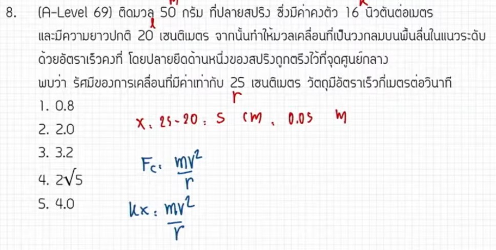

จากการวิเคราะห์ข้อสอบ A-Level ฟิสิกส์ มีนาคม 2569 ข้อที่ 8 จากแหล่งอ้างอิงของพี่ตั้ว Physics Blueprint มีรายละเอียดวิธีทำและเนื้อหาที่ควรศึกษาดังนี้ครับ

### **1. เฉลยวิธีทำโจทย์ข้อ 8 อย่างละเอียด**
โจทย์ข้อนี้เป็นเรื่อง **การเคลื่อนที่แบบวงกลมร่วมกับแรงดึงสปริง** โดยมีวัตถุติดปลายสปริงแล้วแกว่งให้เคลื่อนที่เป็นวงกลมบนพื้นราบลื่น

**ข้อมูลที่โจทย์กำหนด (วิเคราะห์จากขั้นตอนการคำนวณ):**
*   **มวลของวัตถุ ($m$):** 50 กรัม หรือ $0.05$ กิโลกรัม,
*   **ค่าคงตัวสปริง ($k$):** 16 นิวตันต่อเมตร
*   **ความยาวปกติของสปริง ($L_0$):** 20 เซนติเมตร
*   **รัศมีการเคลื่อนที่ ($R$):** 25 เซนติเมตร หรือ $0.25$ เมตร,

**ขั้นตอนการคำนวณ:**
1.  **หาระยะยืดของสปริง ($x$):** ระยะยืดคือรัศมีการเคลื่อนที่ลบด้วยความยาวปกติของสปริง
    *   $x = R - L_0 = 25 - 20 = \mathbf{5}$ **เซนติเมตร** (หรือ $0.05$ เมตร)
2.  **ตั้งสมการสมดุลแรงเข้าสู่ศูนย์กลาง:** ในที่นี้แรงดึงสปริง ($F_s$) ทำหน้าที่เป็นแรงเข้าสู่ศูนย์กลาง ($F_c$)
    *   $F_c = F_s$
    *   $\frac{mv^2}{R} = kx$
3.  **แทนค่าเพื่อหาความเร็ว ($v$):**
    *   $\frac{0.05 \times v^2}{0.25} = 16 \times 0.05$
    *   ตัด $0.05$ ทั้งสองข้าง จะได้ $\frac{v^2}{0.25} = 16$
    *   $v^2 = 16 \times 0.25 = 4$
    *   $v = \mathbf{2}$ **เมตรต่อวินาที**

**สรุปคำตอบ:** ความเร็วของวัตถุมีค่าเท่ากับ **2 เมตรต่อวินาที**

---

### **2. เนื้อหาเพื่อศึกษาเพิ่มเติม**
*   **แรงเข้าสู่ศูนย์กลาง ($F_c$):** คือแรงที่กระทำต่อวัตถุในทิศพุ่งเข้าหาจุดศูนย์กลางของการเคลื่อนที่แบบวงกลม มีสูตรคือ $F_c = \frac{mv^2}{R}$ หรือ $F_c = m\omega^2R$
*   **กฎของฮุค (Hooke's Law):** แรงดึงกลับของสปริงแปรผันตรงกับระยะที่ยืดออกหรือหดเข้าจากตำแหน่งสมดุล ($F_s = kx$) โดย $x$ ต้องเป็น **"ระยะที่เปลี่ยนไป"** ไม่ใช่ความยาวทั้งหมดของสปริง
*   **การแปลงหน่วย:** ในวิชาฟิสิกส์ต้องระวังหน่วยให้เป็นระบบ SI เสมอ เช่น เปลี่ยนกรัมเป็นกิโลกรัม และเปลี่ยนเซนติเมตรเป็นเมตร ก่อนการคำนวณ

---

### **3. กลยุทธ์แก้โจทย์ประเภทนี้**
*   **อย่าสับสนระหว่าง $R$ กับ $x$:** จุดหลอกที่สำคัญที่สุดคือการใช้รัศมี ($R$) แทนระยะยืดสปริง ($x$) นักเรียนต้องวาดรูปแยกให้ชัดเจนว่าสปริงยืดออกมาจากเดิมเท่าไหร่
*   **ระบุตัวให้แรง:** เคล็ดลับของการทำโจทย์วงกลมคือต้องถามตัวเองว่า "แรงอะไรที่ดึงวัตถุเข้าหาจุดศูนย์กลาง?" ในข้อนี้คือแรงสปริง แต่ในข้ออื่นอาจเป็นแรงตึงเชือก หรือแรงเสียดทาน
*   **การตัดตัวแปร:** หากโจทย์ให้เลขที่ดูคำนวณยากมา เช่น 0.05 หรือ 1.6 ให้ลองเขียนในรูปเศษส่วนหรือติดตัวแปรไว้ก่อน เพราะบ่อยครั้งตัวแปรจะตัดกันเองทำให้คิดเลขได้ง่ายขึ้น

---

### **4. ตัวอย่างโจทย์เพิ่มเติมเพื่อฝึกทำ**

**โจทย์:** วัตถุมวล 100 กรัม ติดปลายสปริงที่มีค่า $k = 20$ N/m ความยาวปกติ 10 cm หากแกว่งวัตถุให้เป็นวงกลมบนพื้นราบลื่นจนมีรัศมี 15 cm จงหาความเร็วของวัตถุ (กำหนดให้พื้นราบไม่มีแรงเสียดทาน)

**วิธีคิด:**
1.  **หาระยะยืด ($x$):** $x = 15 - 10 = 5$ cm หรือ $0.05$ m
2.  **ตั้งสมการ:** $\frac{mv^2}{R} = kx$
3.  **แทนค่า:** $\frac{0.1 \times v^2}{0.15} = 20 \times 0.05$
4.  **คำนวณ:** $\frac{0.1 \times v^2}{0.15} = 1$ จะได้ $v^2 = \frac{0.15}{0.1} = 1.5$
5.  **คำตอบ:** $v = \sqrt{1.5} \approx \mathbf{1.22}$ **เมตรต่อวินาที**

*(หมายเหตุ: การวิเคราะห์และขั้นตอนการทำอ้างอิงตามแนวทางการสอนของพี่ตั้ว Physics Blueprint จากแหล่งอ้างอิงที่ได้รับ)*