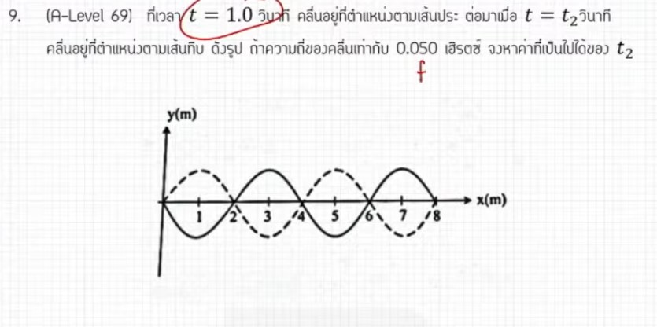

จากการวิเคราะห์ข้อสอบ A-Level ฟิสิกส์ มีนาคม 2569 **ข้อที่ 9** จากแหล่งอ้างอิงของพี่ตั้ว Physics Blueprint พบว่าโจทย์ข้อนี้เป็นเรื่อง **คลื่นกล** ซึ่งมีรายละเอียดและวิธีทำที่น่าสนใจดังนี้ครับ

### **1. เฉลยวิธีทำโจทย์ข้อ 9 อย่างละเอียด**
โจทย์ข้อนี้ให้กราฟการกระจัดกับตำแหน่งของคลื่นมา โดยมีเส้นประแทนคลื่น ณ เวลา $t = 1$ วินาที และเส้นทึบแทนคลื่น ณ เวลา $t$ ที่โจทย์ต้องการให้หา

**ข้อมูลจากโจทย์และกราฟ:**
*   **ความถี่ของคลื่น ($f$):** 0.05 เฮิรตซ์
*   **ความยาวคลื่น ($\lambda$):** จากกราฟจะเห็นว่าหนึ่งลูกคลื่นกินระยะทาง **4 เมตร**
*   **ตำแหน่งคลื่น:** เส้นประอยู่ที่เวลา $t_1 = 1$ วินาที
*   **การเคลื่อนที่:** จากการสังเกตตำแหน่งของสันคลื่นหรือจุดใดจุดหนึ่ง พบว่าคลื่นเคลื่อนที่ไปเป็นระยะทาง $x = 2$ เมตร (หรือครึ่งลูกคลื่นพอดี)

**ขั้นตอนการคำนวณ:**
1.  **หาคาบการเคลื่อนที่ ($T$):** คาบคือเวลาที่ใช้ในหนึ่งลูกคลื่น
    *   $T = 1 / f = 1 / 0.05 = \mathbf{20}$ **วินาที**
2.  **หาเวลาที่เปลี่ยนไป ($\Delta t$):** เนื่องจากคลื่นเคลื่อนที่ไปได้ระยะทาง 2 เมตร ซึ่งคิดเป็น **$\lambda/2$ (ครึ่งลูกคลื่น)**
    *   เวลาที่ใช้จึงเป็นครึ่งหนึ่งของคาบเช่นกัน: $\Delta t = T / 2 = 20 / 2 = \mathbf{10}$ **วินาที**
3.  **หาเวลาที่โจทย์ถาม ($t$):**
    *   $t = t_1 + \Delta t = 1 + 10 = \mathbf{11}$ **วินาที**

**สรุปคำตอบ:** เวลาที่แสดงในเส้นทึบคือ **11 วินาที**

---

### **2. เนื้อหาเพื่อศึกษาเพิ่มเติม**
*   **ส่วนประกอบของคลื่น:** การหาค่าความยาวคลื่น ($\lambda$) จากระยะห่างของสันคลื่นที่ติดกัน และการหาคาบ ($T$) จากส่วนกลับของความถี่ ($1/f$)
*   **เฟสของคลื่น (Wave Phase):** การที่คลื่นเคลื่อนที่ไปครึ่งลูกคลื่น หมายความว่าเฟสเปลี่ยนไป 180 องศา หรือ $\pi$ เรเดียน
*   **ความเร็วคลื่น ($v$):** สามารถหาได้จาก $v = f\lambda$ ในข้อนี้ $v = 0.05 \times 4 = 0.2$ เมตรต่อวินาที

---

### **3. กลยุทธ์แก้โจทย์ประเภทนี้**
*   **หา "จุดสังเกต" บนกราฟ:** ให้เลือกจุดที่ดูง่ายที่สุด เช่น สันคลื่น (Peak) หรือจุดสมดุล แล้วดูว่าเมื่อเปลี่ยนจากเส้นประเป็นเส้นทึบ จุดนั้นเคลื่อนที่ไปทางขวากี่เมตร
*   **ใช้ความสัมพันธ์เชิงสัดส่วน:** หากคลื่นเคลื่อนที่ไปได้ระยะทางเป็นกี่เท่าของ $\lambda$ เวลาที่ใช้ก็จะเปลี่ยนไปเป็นจำนวนเท่าเดียวกันของ $T$ (เช่น เคลื่อนไป $\lambda/4$ ก็ใช้เวลา $T/4$)
*   **ระวังคำว่า "ค่าที่เป็นไปได้":** โจทย์อาจใช้คำนี้เนื่องจากคลื่นเป็นปรากฏการณ์ที่ซ้ำรอบเดิม ทุกๆ 1 คาบคลื่นจะกลับมาที่เดิม ดังนั้นเวลาอาจเป็น $11, 31, 51$ วินาทีก็ได้ (แต่ในตัวเลือกมักจะมีค่าที่น้อยที่สุดมาให้)

---

### **4. ตัวอย่างโจทย์เพิ่มเติมเพื่อฝึกทำ**

**โจทย์:** คลื่นขบวนหนึ่งมีความถี่ 2 เฮิรตซ์ เคลื่อนที่ไปทางขวา กราฟที่เวลา $t = 0$ วินาที มีสันคลื่นอยู่ที่ตำแหน่ง $x = 0$ เมตร จงหาว่าสันคลื่นลูกนี้จะเคลื่อนที่ไปอยู่ที่ตำแหน่ง $x = 1.5$ เมตร เป็นครั้งแรกเมื่อเวลาผ่านไปกี่วินาที (กำหนดให้ความยาวคลื่นเท่ากับ 2 เมตร)

**วิธีคิด:**
1.  **หาคาบ ($T$):** $T = 1 / 2 = \mathbf{0.5}$ **วินาที**
2.  **ระยะทางที่เคลื่อนที่:** โจทย์ให้เคลื่อนที่ไป $1.5$ เมตร ซึ่งคิดเป็นสัดส่วน $1.5 / 2 = \mathbf{0.75}$ **ของความยาวคลื่น**
3.  **หาเวลา:** เวลาที่ใช้คือ $0.75$ ของคาบ $= 0.75 \times 0.5 = \mathbf{0.375}$ **วินาที**

**เฉลย:** ผ่านไป **0.375 วินาที**

*(หมายเหตุ: การวิเคราะห์สัดส่วนของคลื่นและการคำนวณคาบอ้างอิงตามเทคนิคการสอนของพี่ตั้วและพี่ต้นสนจากแหล่งอ้างอิงที่กำหนด)*